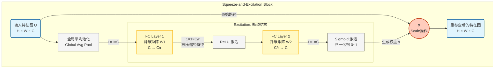

# SE Block(Squeeze and Excitation Block)

> [!NOTE]
>
> *SE Block*本名*Squeeze and Excitation Block*，是*JieHu*等人在*2019*年提出来的一种通道注意力机制模块。
> 它主要的核心就是**让神经网络自己关注比较重要的通道，并且抑制不重要的通道**
>
> **即插即用**的那一种模块

我将从他的原理，公式推导等逐步开始介绍

---


## 1. 背景原理

曾经也就是*2019*年之前的*CNN(卷积神经网络，convolutional neural networks)*例如*VGGnet，Resnet*等在进行卷积操作之后均是让每一个通道都保持基本一致的重要性。

但是实际上并不如此，每个通道的重要性并不相同，我们以最基本的*LeNet*为例子进行阐述。

> *LeNet神经网络是最早的也是最原始的卷积神经网络，由YANN LECUN等人在1998年提出*


输入一张图像经过两次卷积操作，两次池化操作后得到一组**120**个通道的特征图片，注意这**120**通道的特征图片是大小完全一致的图片，我们也可以说这**120**张图片叫做$120$组特征。那么对于手写字母本身而言，特征有超级多种，譬如每个字母的横竖撇捺等等。

但是其中也包括了图像本身的一些特征，譬如：图像的灰度，图像整体的明暗程度等等，这些个特征对于这个任务而言是**无关紧要**的，那么将这些特征也带入到后面的全连接层中，就会使得全连接层变得异常的冗杂。

因此就可以用一些算法将这些没有用的特征给他**抑制**掉，从而将那些有用的特征给他**增强**，这种方法就是注意力机制的方法。

> 本文使用的注意力机制方法就是基本的通道注意力机制：主要关注**什么是重要的**；而空间注意力机制：关注**哪里是重要的**

在这个背景之下$SE-Block$机制孕育而生，他的主要运作方法就只有下面三个步骤

---


## 2.公式推导

这东西就做了一件事情：**搞清楚谁才是真正的老大**

在神经网络里，有几百个通道，每个通道都在提取不同的特征。原本它们是平起平坐的，$SE Block$ 就是要给它们**打分**，重要的给**高分**，不重要的给低分。

### 2.1 压缩-Squeeze

压缩说的特别的帅气，实际上就是基本的**全局平均池化**罢了。
$$
z_c=\mathbf{F}_{sq}(\mathbf{u}_c)=\frac{1}{H\times W}\sum_{i=1}^{H}\sum_{j=1}^{W}u_c(i,j).
$$
这里$H$表示的是输入特征图片的高度，$W$表示的是输入特征图片的宽度，$u_c(i,j)$表示的是第$c$个通道的第$(i,j)$像素的大小是什么。

这么一来就可以求得某个通道$c$的平均像素值，注意这里是一个标量也就是说$z_c$的本身是一个标量，公式计算出来的仅仅是一个单纯的数字而已。

对于这个公式的理解：你可以把卷积神经网络中的每一个通道（Channel）想象成一个专门的**侦探**，负责寻找某种特定的特征。
通道 A 负责找“猫耳朵”，通道 B 负责找“车轮”，通道 C 负责找“复杂的纹理背景”。

当你输入一张图片后，这些通道会在图上通过卷积操作产生反应：

- 如果图中真的有猫耳朵，通道 A 的特征图里就会有很多高数值。
- 如果图中没有猫耳朵，通道 A 的特征图里数值就很低，或者大部分是 0。

这个公式 $z_c$ 做的就是：给这个“侦探”打个总分。

它不关心猫耳朵具体在图的左上角还是右下角，它只关心：**整张图来看，猫耳朵这个特征出现的强烈程度是多少**

- 如果 $z_c$ 很大：说明这个通道提取到了非常丰富的信息，这个通道对当前图片**很重要**。
- 如果 $z_c$ 很小：说明这个通道在这个图里没找到啥东西，基本在划水，这个通道**不重要**。


### 2.2 激励-Excitation

这玩意儿其实就是用来捕获通道之间的依赖关系，生成权重的一种方法罢了。
$$
s=\sigma(W_2\delta(W_1Z))
$$
$s$表示的就是权重；$\sigma$表示的就是$sigmoid()$函数用来进行归一化的操作；$\delta$表示的是$ReLU()$函数；第一个矩阵$W_1$是一个$\frac{c}{r}\times c$这么一个大小的矩阵，用来进行降维度；第一个矩阵$W_2$是一个$c \times \frac{c}{r} $这么一个大小的矩阵，用来进行升高维度。

这东西其实就是一个微形的**多层感知机**，只是由于输入和输出的通道数过大直接放进全连接层里面太大了就给他降降维度。

也可以说是 $SE Block$ 的大脑。它拿到了那 64 个总结数字，开始思考：**“针对现在的任务，哪些特征是重要的”**

### 2.3 加权

将学习的权重用到原始的特征图上面。把刚才算出来的 $C$ 个权重，分别乘到原始输入特征图的 $C$ 个通道上
$$

$$

---


## 3.SEBLOCK结构框图和基本代码展示

### 3.1 结构框图




### 3.2 

```python
import torch 
import torch.nn as nn
import matplotlib.pyplot as plt
import torch.nn.functional as F
import torch.optim as optim
from torchvision import datasets, transforms
from torch.utils.data import DataLoader
import os
import numpy as np
import gzip
import sys

device = torch.device("cuda" if torch.cuda.is_available() else "cpu")
print(f"Using device: {device}")

class SEBlock(nn.Module):
    '''SEBlock: Squeeze-and-Excitation Block 注意力机制模块
        Args:
            out_channels:   输入特征图的通道数
            reduction:      压缩比例,默认值为4
    '''
    def __init__(self ,out_channels , reduction = 4):
        super(SEBlock, self).__init__()
        self.global_avg_pool  = nn.AdaptiveAvgPool2d(1)
        self.fc1 = nn.Linear(out_channels, out_channels // reduction , bias=False)
        self.relu = nn.ReLU()
        self.fc2 = nn.Linear(out_channels // reduction , out_channels , bias=False)
        self.sigmoid = nn.Sigmoid()
    
    def forward(self , x):
        b , c , h , w = x.size()                    # 获取输入特征的尺寸，b:batch_size,c:channels,h:height,w:width

        y  = self.global_avg_pool(x).view(b , c)    # 第一步：全局平均池化，得到每个通道的全局特征Sequence，[b, c, 1, 1] -> [b, c]

        y = self.fc1(y)
        y = self.relu(y)
        y = self.fc2(y)
        y = self.sigmoid(y).view(b , c , 1 , 1)     # 第二步：通过两个全连接层和激活函数，得到每个通道的权重,先降低维度后上升维度[b,c] -> [b,c,1,1]

        out = x * y                                 # 第三步：将权重与原始特征图相乘，进行通道的重新校准        

        return out
```


