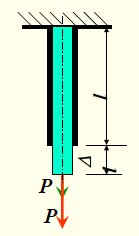
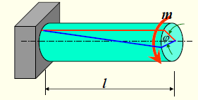
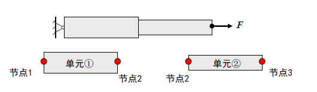
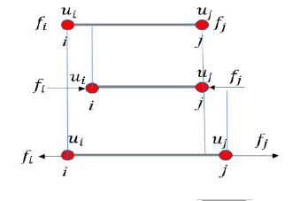
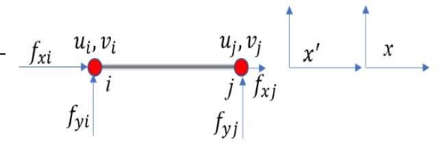

# 结构有限元分析及其应用

> 该课程主要就是讲述了在平常我们一般使用的软件中例如$Ansys$等，这些软件的内部是如何进行一系列的运作和原理的。
>
> 课程的PPT均放置在[PDF文件夹](E:\typora\19 PDF)中。

---

## 1 杆及弹簧单元

> [PPT的位置](E:\typora\19 PDF\杆及弹簧单元.pdf)
> [[杆]]

### 0 引言

首先让我们先看一些实际的例子

1. 如下图所示，一根**普通的直杆**在收到轴向力$P$的条件下，发生了拉伸变形，原本的长度$l$在力的作用之下变成了$l+\delta l$。
    此时可以根据材料力学的一些定律求得

$$
\delta l = \frac{Pl}{EA} = \frac{P}{EA/l}，即变化量(位移)=\frac{外力}{刚度}
$$

​	其中$E$表示弹性模量，$A$表示杆的横截面积。

> [注]：$E=σ/ε$
> **弹性模量**（Elastic Modulus）是描述材料在弹性变形阶段抵抗形变能力的重要参数。它反映了材料在受力时应力$（σ）$与应变$（ε）$的线性关系，公式为：$E=σ/ε$。弹性模量不仅是材料刚度的度量，也是原子、离子或分子之间键合强度的反映。
> 弹性模量的单位一般是$Mpa$。

2. 如下图所示，**一根粗杆**，在力矩$M$的作用之下发生了扭转变形，根据材料力学的扭转刚度公式可以知道，该杆转动的角度为:

$$
\varphi =\frac{Ml}{GI_p}=\frac{M}{GI_p / l}，即变化量(位移)=\frac{外力}{刚度}
$$

​	其中$G$表示扭转弹性模量，$I_p$表示扭转刚度。

> [注]：$G$
> **扭转模量**（modulus in torsion），又称扭转弹性模量，是材料在比例极限内扭转应力与扭转应变的比值，常用符号$G$表示，属于材料力学性能中最稳定的指标之一。 其与杨氏模量$E$、泊松比$μ$满足关系式$G=E/ [2 (1+μ)]$。 该模量通过扭转试验测定，对于直径d₀、长度L₀的圆柱试样，测得扭矩M作用下两截面相对扭转角φ时，计算公式为$G=32ML₀/ (πφd₀⁴)$。

**综合上述，不难看出这些东西都遵循胡可定律的感觉即：$ =\frac{P}{k}$**

因此可以将这个公式进行一次变形得到
$$
P = K \bigtriangleup ,即 F=Kx
$$
这个是仅仅只有一个自由度的'弹簧'，现在将他扩展到多个自由度，也就是说不一定只有一个外力，有可能有很多外力，并且方向还不一定，这个时候就需要采用矩阵的形式进行表达：
$$
F=Kx \Rightarrow  [F]=[K][X] \Rightarrow  [载荷矩阵]=[刚度矩阵][位移矩阵]
$$

### 1 杆单元的各种定义

一般来说，杆系结构中的杆件、梁、柱等都是杆系单元，并且两个杆系单元直接相互链接的点称为节点，杆系单元多为一维单元。

### 2 杆单元的刚度矩阵

杆单元就是一根只会受到**拉压**的二力杆，他的单元两端各有一个节点，设这两个节点的位移分别为$u_i , u_j$，并假设这两个节点受到的力为$f_i , f_j$

仔细看，上面总共有两种位移的可能性。

- 第一种，$j$被固定，此时$u_i=u_i,u_j=0$

    - 对于左侧节点$i$，$f_i$向右，$u_i$向右，则$f_i= ku_i$； 

    - 对于右侧节点$j$，$f_j$向左，$u_i$向右，则$f_j=-ku_i$;

- 第二种，$i$被固定，此时$u_i=0,u_j=u_j$

    - 对于左侧节点$i$，$f_i$向左，$u_j$向右，则$f_i= -ku_i$； 

    - 对于右侧节点$j$，$f_j$向右，$u_j$向右，则$f_j=ku_i$;

- 综上：将两个结果进行叠加，可以求得两端都可以变位的单元节点力为：

    - $f_i=Ku_i-Ku_j$
    - $f_j=-Ku_i+Ku_j$

将他写成矩阵的形式为：
$$
\begin{pmatrix}f_i\\f_j\end{pmatrix}=K\begin{bmatrix}1&-1\\-1&1\end{bmatrix}\begin{pmatrix}u_i\\u_j\end{pmatrix}=[k]^e\begin{pmatrix}u_i\\u_j\end{pmatrix}
$$
其中$=K\begin{bmatrix}1&-1\\-1&1\end{bmatrix}=[k]^e$，称作**单元刚度矩阵**。
这个$k$就是之前的刚度$k$，对于直杆拉伸而言是$\frac{EA}{l}$，对于粗杆扭转而言是$\frac{GI_p}{l}$。

但是对于杆单元而言，每个节点的自由度是2，因此受力不仅仅可以在水平方向上，也可以出现在竖直方向之上。

可以得到**竖直方向**上的节点受力为:
$$
\begin{pmatrix}f_{yi}\\f_{yj}\end{pmatrix}=K\begin{bmatrix}1&-1\\-1&1\end{bmatrix}\begin{pmatrix}v_i\\v_j\end{pmatrix}=[k]^e\begin{pmatrix}v_i\\v_j\end{pmatrix}
$$
而**水平方向**上的节点受力为：
$$
\begin{pmatrix}f_{xi}\\f_{xj}\end{pmatrix}=K\begin{bmatrix}1&-1\\-1&1\end{bmatrix}\begin{pmatrix}u_i\\u_j\end{pmatrix}=[k]^e\begin{pmatrix}u_i\\u_j\end{pmatrix}
$$
将这两个矩阵进行叠加可以得到：
$$
\begin{pmatrix}f_{xi}\\f_{yi}\\f_{xj}\\f_{yj}\end{pmatrix}=k\begin{bmatrix}1&0&-1&0\\0&0&0&0\\-1&0&1&0\\0&0&0&0\end{bmatrix}\begin{pmatrix}u_i\\v_i\\u_j\\v_j\end{pmatrix}=\frac{AE}{l}\begin{bmatrix}1&0&-1&0\\0&0&0&0\\-1&0&1&0\\0&0&0&0\end{bmatrix}\begin{pmatrix}u_i\\v_i\\u_j\\v_j\end{pmatrix}
$$
则$\text{单元轴力:}\quad N=\frac{AE}{l}\begin{bmatrix}-1&0&1&0\end{bmatrix}\begin{pmatrix}u_i\\v_i\\u_j\\v_j\end{pmatrix}=[S]\{\delta\}^e\quad\text{其中:}\{\delta\}^e=\begin{bmatrix}u_i&v_i&u_j&v_j\end{bmatrix}^T$

### 3 位移函数

