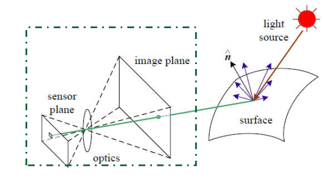
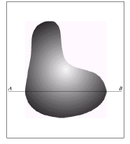
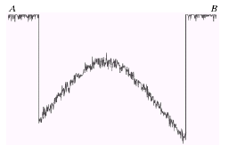
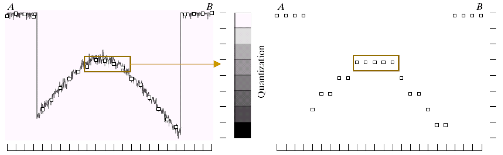
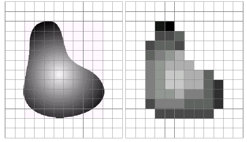
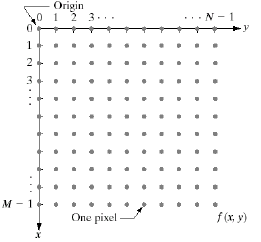
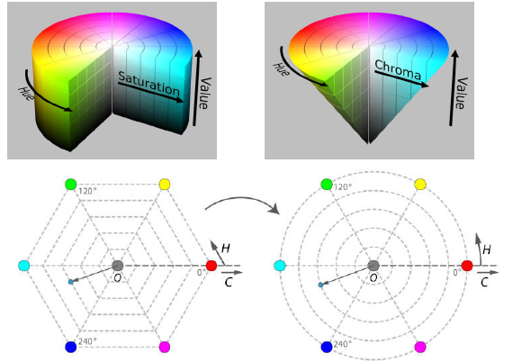

# 7 图像处理与人工智能

[TOC]

---

## 1 图像基础和图像处理

### 1.1 图像基础

#### 1.1.1 图像的形成

一个图像的形成需要三个要素：

1. 光源-light source
2. 反射表面-surface 
3. 成想屏幕-sensor plane

当光照射到反射表面的时候，光线就发生了反射，这个时候便会在屏幕上出现图像。

> 中古古代著名的小孔成像也是这个原理。

#### 1.1.2 计算机中的图像

图像是一个模拟信号，但是计算机只能处理数字信号，因此需要将模拟信号转换成数字信号。在这里我们用一个灰度图片进行举例。

像是这个图片而言，我们对其中的某一行像素进行采样（比如$AB$），这个时候便可以得到$AB$上各个位置的灰度数据，这就是采样的过程（$sampling$）。如下所示。

此时我们需要将这些数据进行一定的处理将灰度进行划分，将一定区域的灰度值定义成一种类型。比如下面这个表格一样。

| sample | result |
| ------ | ------ |
| 0-5    | 0      |
| 5-10   | 1      |
| ....   | ....   |

这个时候就可以将这些个模拟信号转换成计算机认识的**八位数字信号**了。

此时原本的图片也就处理成了计算机认识的灰度图片，也可以说是一个灰度矩阵。

> 注意：在进行采样的过程中，如果采样的等级越大那么图片就会越小。如果采样后的种类越少，就会越来越接近黑白分明的图片。

#### 1.1.3 颜色空间

在现实世界中颜色空间我想只有一种也就是$RGB$三原色空间，但是到了计算机里面就不仅仅只有这一种颜色空间了。

计算机主要的颜色空间有下面几种：

1. $RGB$
2. $HSV$
3. $YCbCr$
4. $LAB$
5. $CMYK$
6. $XYZ$

在这里我们主要以前三种为例子进行详细的讲解。

> 首先就是最经典的$RGB$三原色空间

> 这里借用一下其他人的图片[^1]

不难看出$RGB$实际上就是一个三维的模型空间，每一个像素都是一个立方体，每一个像素都是RGB三原色的颜色混合。

但是$RGB$并不是特别的完美：

1. 不够直观，谁知道这三个数据混合出的玩意儿是啥颜色。
2. 不够线性平滑，两种颜色之间的差异和这两种颜色空间点之间的距离基本无关。

> 下一种就是$HSV$颜色空间

$HSV(Hue, Saturation, Value)$是根据颜色的直观特性由$A. R. Smith$在1978年创建的一种颜色空间, 也称六角锥体模型$(Hexcone Model)$。

这个模型中颜色的参数分别是：色调或者色相（H），饱和度（S），明度（V）。

1. **色调H**：用角度度量，取值范围为0°～360°，从红色开始按逆时针方向计算，红色为0°，绿色为120°,蓝色为240°。它们的补色是：黄色为60°，青色为180°,紫色为300°；

2. **饱和度S**：饱和度S表示颜色接近光谱色的程度。一种颜色，可以看成是某种光谱色与白色混合的结果。其中光谱色所占的比例愈大，颜色接近光谱色的程度就愈高，颜色的饱和度也就愈高。饱和度高，颜色则深而艳。光谱色的白光成分为0，饱和度达到最高。通常取值范围为0%～100%，值越大，颜色越饱和。

3. **明度V**：

4. 明度表示颜色明亮的程度，对于光源色，明度值与发光体的光亮度有关；对于物体色，此值和物体的透射比或反射比有关。通常取值范围为0%（黑）到100%（白）。

    $RGB$和$CMY$颜色模型都是面向硬件的，而$HSV（Hue Saturation Value）$颜色模型是面向用户的。

    $HSV$模型的三维表示从RGB立方体演化而来。设想从$RGB$沿立方体对角线的白色顶点向黑色顶点观察，就可以看到立方体的六边形外形。六边形边界表示色彩，水平轴表示纯度，明度沿垂直轴测量[^2]。

> 最后说一下$YCbCr$颜色空间吧

### 1.2 图像处理

### 1.3 参考文献

[^1]:https://blog.csdn.net/dengjin20104042056/article/details/116427546
[^2]:https://blog.csdn.net/dengjin20104042056/article/details/116447936
