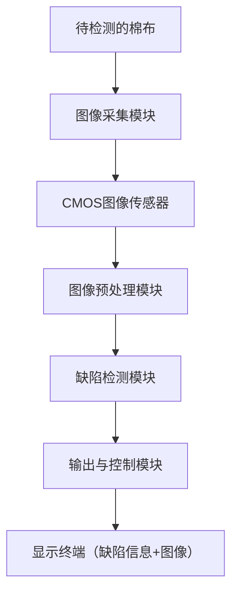

# Final project

## 1 introduction

本文所需要提取的目标项目如下图1所示。四张图片差异较小，主要的区别就是电脑的品牌以及电脑上盒子的图案。

```mermaid
graph TD
    A[待检测的棉布] --> B[图像采集模块]
    B --> B1[CMOS图像传感器]
    B1 --> C[图像预处理模块]
    C --> D[缺陷检测模块]
    D --> G[输出与控制模块]
    G --> G1[显示终端（缺陷信息+图像）]
```

