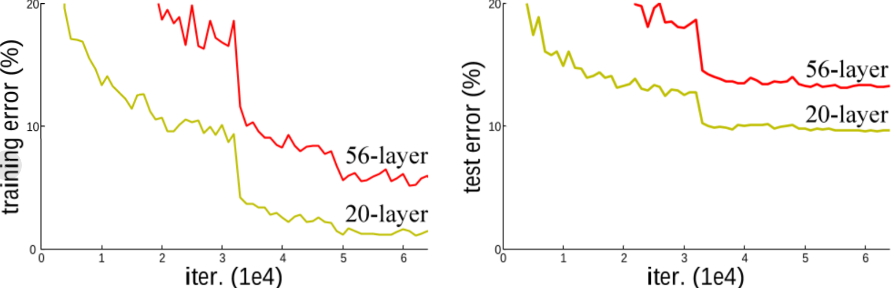
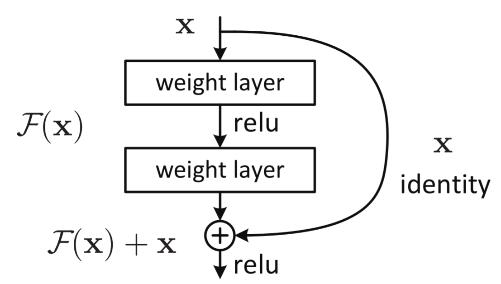

#                    图像识别的深度残差学习（翻译）

---

## 摘要

深度神经网络非常难以进行训练。我们提出了一种残差学习的框架，用来简化这些网络，而这可以训练比以前使用的深度大的多的网络。我们显性的将层重新表示成参考曾输入的学习残差函数，而不是学习那些未参考的函数。我们提供了全面的经验证据，表明这些残差网络更加容易进行优化，并且可以十分显著的从增加的深度中获得一定的精度。在ImageNet数据集上，我们评估了深度高达152层的残差神经网络，该网络的数量比VGG神经网络要深整整**8**倍，但是任然具有较低的复杂性。这些残差网络的集合在ImageNet测试集上面的误差达到了3.57%该结果在ILSVRC2015分类任务中获得了第一名的好成绩。同时还对100层以及1000层的CIFAR-10进行了分析。

表层的深度对于许多的视觉识别任务至关重要。仅仅由于我们极其深的神经网络的表示，就让我们在COCO对象检测数据集上获得了28%的相对改进。深度残差网络是我们提交给2015年ILSVRC和COCO竞赛的基础，我们同样还在ImageNet检测和ImageNet定位、COCO检测和COCO分割的任务中获得了第一名的好成绩。

---

## 1.引言

深度卷积神经网络为图像分类带来了一系列突破。深度网络以端到端多层的方式自然地集成了低/中/高级特征和分类器，特征的“层次”可以通过堆叠层的数量(深度)来丰富。最近的证据表明，网络深度是至关重要的，在具有挑战性的*ImageNet*数据集上的领先结果都利用了“非常深”的模型，深度为*16*到*30*。许多其他重要的视觉识别任务也利用了这种方法这极大的受益于非常深的模型。

在模型深度的重要性的驱动之下，一个问题出现了：学习更好的网络就像是堆叠更多的层一样简单吗？回答这个问题的一个严重的障碍就是一个臭名昭著的梯度消失的问题，他从一开始就阻碍了收敛。然而，这个问题已经通过规范化初始化和中间规范化层得到了很大程度的决，这使得具有数十层的网络能够开始收敛随机梯度下降*(SGD)*，并具有反向传播的方式。

当更深的网络能够开始收敛时，一个退化问题就暴露出来了:随着网络深度的增加，精度趋于饱和*(这可能并不奇怪)*，然后迅速退化。出乎意料的是，这种退化不是由过拟合引起的，在合适深度的模型上添加更多的层会导致更高的训练误差，正如报道的那样，我们的实验已经彻底验证了这一点。下图给出了一个典型的例子。

训练精度的退化表明，并非所有系统都同样容易优化。让我们考虑一个较浅的体系结构和它的更深的对应物，它在上面添加了更多的层。通过构造深层模型存在一种解决方案:添加的层是身份映射，其他层是从学习过的较浅模型中复制的。这种构造解的存在表明，较深的模型应该不会比较浅的模型产生更高的训练误差。但实验表明，我们现有的解算器无法找到与构建的解决方案相当好或更(或无法在可行时间内做到这一点)。

在此拟合另一篇论文中，映射我们处理$F(x)的退化:= H(x) - x$。问题的起源-通过引入深度残差学习框架。我们不是希望每几个堆叠层都直接适合期望的底层映射，而是明确地让这些层适合残差映射。形式上，我们将期望的底层映射表示为$H(x)$，我们让堆叠的非线性最终映射重新映射为$F(x)+x$。我们假设优化残差映射比优化原始的、未引用的映射更容易。在极端情况下，如果一个恒等映射是最优的，那么将残差推至零比通过一堆非线性层拟合一个恒等映射更容易。

$F(x)+x$的公式可以通过具有“快捷连接”的前馈神经网络来实现。快捷连接是那些跳过一层或多层的。在我们的例子中，快捷连接只是执行身份映射，它们的输出被添加到堆叠层的输出中(图2)。身份快捷连接既不增加额外的参数，也不增加计算复杂度。整个网络仍然可以通过反向传播的*SGD*进行端到端训练，并且可以在不修改求解器的情况下使用通用库轻松实现。

我们在*ImageNet*上进行了全面的实验，以显示退化问题并评估我们的方法。我们表明:
*1)*我们的极深残差网络很容易优化，但对应的“普通”网络(简单地堆叠层)在深度增加时表现出更高的训练误差;
*2)*我们的深度残差网络可以很容易地从深度的大幅增加中获得精度增益，产生的结果明显好于以前的网络。
类似的现象也出现在*CIFAR-10*集上，这表明我们的方法的优化困难和效果不仅仅类似于特定的数据集。我们在这个超过*100*层的数据集上展示了成功训练的模型，并探索了超过*1000*层的模型。在ImageNet分类数据集上，利用极深残差网获得了很好的分类结果。我们的152层残差网络是迄今为止在ImageNet上呈现的最深的网络，同时仍然比*VGG*网络具有更低的复杂性。我们的集合在*ImageNet*测试集上的前*5*名错误率为*3.57%*，并在*ILSVRC 2015*分类大赛中获得第一名。极深表征在其他识别任务上也具有出色的泛化性能，并使我们在ILSVRC & COCO 2015竞赛中，在*ImageNet*检测、ImageNet定位、*COCO*检测和COCO分割方面进一步获得第一名。这一强有力的证据表明，残差学习原理是通用的，我们期望它适用于其他视觉和非视觉问题。

---

## 2.相关工作

**残差表征。**在图像识别中，*VLAD*是对字典的残差向量进行编码的表示，*Fisher*向量可以表示为VLAD的概率版本。它们都是用于图像检索和分类的强大的浅层表示。对于矢量量化，编码残差矢量被证明比编码原始矢量更有效。

在低级视觉和计算机图形学中，为了求解偏微分方程*(PDEs)*，广泛使用的多重网格方法将系统重新表述为多尺度的子问题，其中每个子问题负责粗尺度和细尺度之间的残差解。多重网格的替代方案是分层基预处理，它依赖于表示两个尺度之间残差向量的变量。已经证明，这些求解器比不知道解的残差性质的标准求解器收敛得快得多。这些方法表明，良好的重新表述或预处理可以简化优化。

**快捷连接。**导致快捷连接的实践和理论已经被研究了很长时间。训练多层感知器*(mlp)*的早期实践是添加一个从网络输入连接到输出的线性层。在中，一些中间层直接连接到辅助分类器，用于寻路消失/爆炸梯度。的论文提出了通过快捷连接实现对层响应、梯度和传播误差居中的方法。在其中，一个“初始”层由一个快捷分支和几个更深的分支组成。

与我们的研究同时，“高速公路网”呈现出与门控函数的快捷连接。这些门依赖于数据并具有参数，与我们的无参数身份快捷方式形成对比。当一个门控捷径是“封闭的”(接近于零)时，公路网中的层表示非残差函数。相反，我们的公式总是学习残差函数;我们的身份快捷方式永远不会关闭，所有的信息总是通过传递，还有额外的残差函数需要学习。另外，高速网络在深度极大增加(例如，超过100层)的情况下没有表现出准确性的提高。

---

## 3.深度残差学习

### 3.1 残差学习

F(x) Let:=我们考虑H(x)−x。H(x)原始的底层函数映射因此变得由几个堆叠层(不一定是整个网络)拟合，其中x表示这些层的第一层的输入。如果假设多个非线性层可以渐近地逼近复杂函数2，那么等价于假设它们可以渐近地逼近残差函数，即H(x)−x(假设输入和输出具有相同的维数)。因此，与其期望堆叠层近似H(x)，不如显式地让这些层近似残差函数F(x)+x。虽然这两种形式都应该能够渐近地逼近所需的函数(如假设的那样)，但学习的难易程度可能会有所不同。

这种重新表述的动机是关于退化问题的反直觉现象(图1，左)。正如我们在引言中讨论的那样，如果可以将添加的层构造为身份映射，则较深的模型应该具有不大于较浅对应模型的训练误差。退化问题表明，求解器在用多个非线性层逼近恒等映射时可能存在困难。通过残差学习的重新表述，如果恒等映射是最优的，求解器可以简单地将多个非线性层的权重向零驱动，从而逼近恒等映射。

在实际情况下，身份映射不太可能是最优的，但我们的重新表述可能有助于预先解决问题。如果最优函数更接近于恒等映射，而不是零映射，那么求解器应该更容易找到参考恒等映射的扰动，而不是将函数作为一个新函数来学习。我们通过实验(图7)表明，学习到的残差函数通常具有较小的响应，这表明恒等映射提供了合理的预处理。

### 3.2 快捷方式的恒等映射

### 3.3 网络架构

### 3.4 实现

