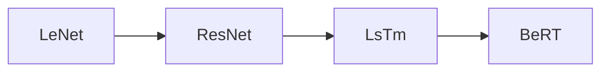

# 1 什么是深度学习

[TOC]

---

## 0 引言

本课程主要就是根据b站up主李沐老师的课程进行的学习

这个是课程的[主页](https://courses.d2l.ai/zh-v2/)

上面展示了深度学习的一些知识以及用到的知识结构

过去八年之间最热的方向就是**计算机视觉**以及**深度学习**这两个大方向

## 1 课程的一些重要链接

[课程的主页](https://courses.d2l.ai/zh-v2/)

[课程的教材](https://zh-v2.d2l.ai/)

## 2.深度学习的一些应用以及介绍

现阶段深度学习应该是人工智能最最火热的一个大方向

而这个课程主要是要用自己的双手动手解决问题的

主要是使用pytorch进行代码上面的使用