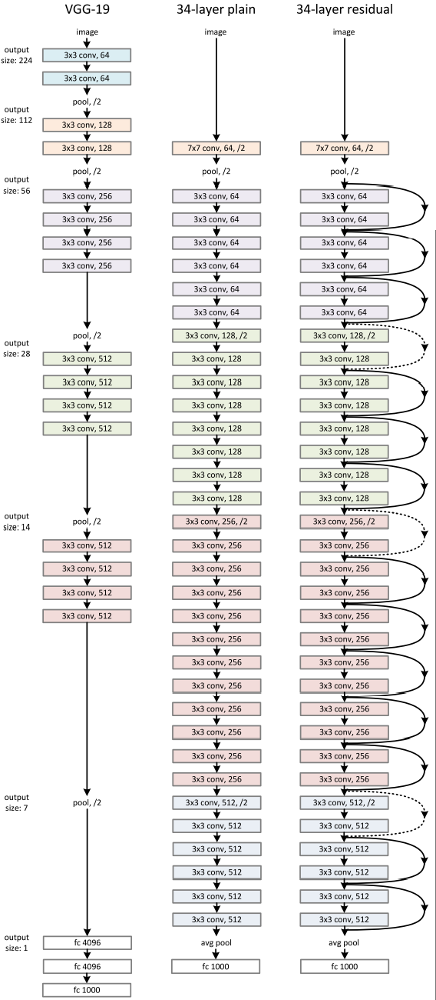
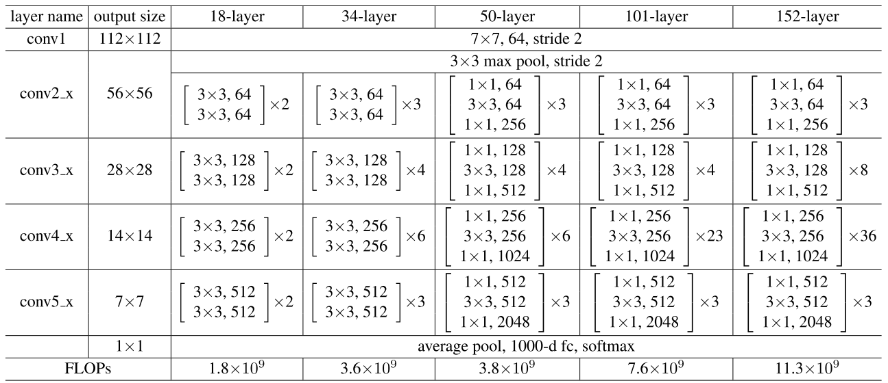

# ResNet

> [!NOTE]
>
> *ResNet*应该是卷积神经网络在图像处理领域的一座高山了，也可以说是神经网络的一座历程碑意义的架构创新。
>
> *ResNet*是何恺明等人于2016年在论文*Deep Residual Learning for Image Recognition*中提出的一种新方法。该论文也是*CVPR*当年的最佳论文，同时也是迄今为止神经网络方向引用率最高的一篇著作

---


---


## 1 模型创作背景

在大家都知道，如果想要提升神经网络模型的能力，无非通过两种手段：其一猛拉深度；其二猛提宽度。其中深度最具代表性的应该就是*VGGNet*，它的深度之深在当时无与伦比；而宽度最具代表性的网络应该就是*GoogleNet*了，它使用的分支结构让自己的网络宽度十分惊人。

但是一味的提高宽度和深度，不仅仅会造成计算以及参数量的过大，还会造成不知道为什么出现的精度下降的情况。就和下面图片中展示的这样子。


非常的出人意料，更加深的网络但是训练的精度却远远没有低深度的网络来的好，这个问题在当时是非常难以相信的一件事情

当网络的深度增加时，其准确性降低，这显然不是过拟合导致的。我觉的很有可能是因为梯度的消失和爆炸的问题。该问题虽然已经通过下面的两种措施得到了一定晨读的缓解，但是非常非常深的哪一种神经网络是很难进行优化的。

1. 初始状态归一化
2. 中间状态归一化

> 本文也没有对这个现象做出解释，当然这也不是过拟合的问题，就连作者本人也仅仅只是解决了这个问题，但并未对问题产生的原因进行推理，这应该就是神经网络黑箱模型中难以看到的其中一块儿吧！

为了解决这种深层神经网络在训练过程中出现退化的问题，作者就提出了一种深度残差学习的框架。

> 退化问题就是前面说到的，深度增加但是准确率不降反而上升了。

这个框架非常巧妙的使用了一根跳线，将输入和输出直接连在了一起，通过学习残差来确保学习的效率，降低出现这种退化的可能性。

---


## 2 模型整体架构

我想这整一篇文章的核心就是下面这副图片。这图展示的就是基本的残差块儿~~

> 这里使用块的结构就是和之前的*VGGNet*的结构有异曲同工之妙，可见VGG最强的并非是全篇使用小卷积核，而是将网络使用块的结构来处理的。这就是*VGGNet*最大的贡献，虽然学习的深入，这个贡献的感受应该是越来越深刻。


这里我们假设理想的输入是$H(x)$，也就是说学的最完美的状态就是$H(x)$；输入是$x$这个就不再多说了，输入就是输入没啥好说的；中间的这一堆变化我们命名一下就称作是$F$吧。

那么在不考虑理想状态的情况之下，他的输入就是$F(x)$，只有非常理想的情况才是$H(x)$。

那我们的目的肯定是希望模型学的越来越好，那么最后需要学习的东西就变成了$H(x)-x$，我们希望就希望这个东西能被模型彻底的学到，而这样子学就好学一点。

换一种说法就是：我的输入$x$，经过模型后的输入就是$y=F(x)+x$，这个时候有一个$x$卡在这里了，那么这么做的目的就是为了就是防止出现很大的问题，哪怕我这个网络的$F$学习的再烂，我也至少有输入的特征这么个信息，不至于特别的差劲。就是一个大保底的感觉啦。

结合这个思路，以及之前*VGGNet*的结构，那么就产生了两种具体的残差块儿，分别运用在较低层数的网络架构以及较高层数的网络架构之上。


这么一来就完美实现了残差连接的思想。

---


## 3 模型的代码实现

这个模型的代码实现最主要的肯定是残差块的一些搭建啦。

首先就是较低层数的残差块。

```python
import torch
import torch.nn as nn

class ResNetBlock_34(nn.Module):
    '''ResNet在34层以及18层使用的基本块
        Args:
            in_channels:    输入特征图的通道数
            out_channels:   输出特征图的通道数
            stride:         卷积步幅,默认值为1
            padding:        卷积填充,默认值为1
        Returns:
            输出特征图
    '''
    def __init__(self , in_channels , out_channels , stride = 1 , padding = 1):
        super(ResNetBlock_34 ,self ).__init__()
        self.conv1 = nn.Conv2d(         
            in_channels=in_channels , 
            out_channels=out_channels , 
            stride=stride , 
            padding = padding , 
            kernel_size = 3 , 
            bias = False
            )
        self.bn1 = nn.BatchNorm2d(out_channels)
        self.relu1 = nn.ReLU(inplace=True)
        self.conv2 = nn.Conv2d(in_channels=out_channels , out_channels=out_channels , stride=1 , padding = 1 , kernel_size = 3 , bias = False)
        self.bn2 = nn.BatchNorm2d(out_channels)
        self.relu2 = nn.ReLU(inplace=True)

        self.downsample = None
        if stride != 1 or in_channels != out_channels:
            # 如果输入输出通道数不匹配，或者步幅不为1，则需要下采样
            self.downsample = nn.Sequential(
                nn.Conv2d(in_channels=in_channels , out_channels=out_channels , stride=stride , kernel_size=1 , bias=False),#1x1卷积改变通道数和尺寸
                nn.BatchNorm2d(out_channels)
            )
    def forward(self , x):
        identity = x 
        if self.downsample is not None:
            identity = self.downsample(x)
        x = self.conv1(x)
        x = self.bn1(x)
        x = self.relu1(x)
        x = self.conv2(x)
        x = self.bn2(x)
        out = x + identity 
        out =  self.relu2(out)
        return out 
```

其次就是较高层数的残差块

```python
import torch
import torch.nn as nn

class ResNetBlock_50(nn.Module):
    '''ResNet在50层及以上使用的瓶颈块
        Args:
            in_channels:    输入特征图的通道数
            out_channels:   输出特征图的通道数
            stride:         卷积步幅
            padding:        卷积填充
        Returns:
            输出特征图
    '''
    def __init__(self , in_channels , out_channels , stride = 1 , padding = 0):
        super(ResNetBlock_50 ,self ).__init__()
        self.conv1 = nn.Conv2d(in_channels=in_channels , out_channels=out_channels , stride=1 , padding = 0 , kernel_size = 1 , bias = False)
        self.bn1 = nn.BatchNorm2d(out_channels)
        self.relu1 = nn.ReLU(inplace=True)
        self.conv2 = nn.Conv2d(in_channels=out_channels , out_channels=out_channels , stride=stride , padding = 1 , kernel_size = 3 , bias = False)
        self.bn2 = nn.BatchNorm2d(out_channels)
        self.relu2 = nn.ReLU(inplace=True)
        self.conv3 = nn.Conv2d(in_channels=out_channels , out_channels=out_channels * 4 , stride=1 , padding = 0 , kernel_size = 1 , bias = False)
        self.bn3 = nn.BatchNorm2d(out_channels *4)
        self.relu3 = nn.ReLU(inplace=True)
        self.downsample = None
        if stride != 1 or in_channels != out_channels * 4:
            # 如果输入输出通道数不匹配，或者步幅不为1，则需要下采样
            self.downsample = nn.Sequential(
                nn.Conv2d(in_channels=in_channels , out_channels=out_channels * 4 , stride=stride , kernel_size=1 , bias=False),
                nn.BatchNorm2d(out_channels * 4)
            )
    def forward(self , x):
        identity = x 
        if self.downsample is not None:
            identity = self.downsample(x)
        x = self.conv1(x)
        x = self.bn1(x)
        x = self.relu1(x)
        x = self.conv2(x)
        x = self.bn2(x)
        x = self.relu2(x)
        x = self.conv3(x)
        x = self.bn3(x)
        out = x + identity 
        out =  self.relu3(out)
        return out
```

最后结合论文中对*VGGNet*的网络变体，就产生了多种*ResNet*网络架构，如下图所示。



具体的数据就是表格中的一样。



```python
class ResNet_18(nn.Module):
    '''ResNet-18网络结构'''
    def __init__(self):
        super(ResNet_18, self).__init__()
        self.layer1 = nn.Sequential(
            nn.Conv2d(3 , 64 , kernel_size=7 , stride=2 , padding=3 , bias=False),
            nn.BatchNorm2d(64),
            nn.ReLU(inplace=True),
            nn.MaxPool2d(kernel_size=3 , stride=2 , padding=1)
        )

        self.layer2 = nn.Sequential(
            ResNetBlock_34(64 , 64),
            ResNetBlock_34(64 , 64)
        )

        self.layer3 = nn.Sequential(
            ResNetBlock_34(64 , 128 , stride=2 , padding=1),
            ResNetBlock_34(128 , 128)
        )

        self.layer4 = nn.Sequential(
            ResNetBlock_34(128 , 256 , stride=2 , padding=1),
            ResNetBlock_34(256 , 256)
        )

        self.layer5 = nn.Sequential(
            ResNetBlock_34(256 , 512 , stride=2 , padding=1),
            ResNetBlock_34(512 , 512)
        )

        self.layer6 = nn.Sequential(
            nn.AdaptiveAvgPool2d((1,1)),
            nn.Flatten(),
            nn.Linear(512 , 1000 , bias=True)
        )
    def forward(self , x):
        x = self.layer1(x)
        x = self.layer2(x)
        x = self.layer3(x)
        x = self.layer4(x)
        x = self.layer5(x)
        x = self.layer6(x)
        return x
    


class ResNet_34(nn.Module):
    '''ResNet-34网络结构'''
    def __init__(self):
        super(ResNet_34, self).__init__()
        self.layer1 = nn.Sequential(
            nn.Conv2d(3 , 64 , kernel_size=7 , stride=2 , padding=3 , bias=False),
            nn.BatchNorm2d(64),
            nn.ReLU(inplace=True),
            nn.MaxPool2d(kernel_size=3 , stride=2 , padding=1)
        )

        self.layer2 = nn.Sequential(
            ResNetBlock_34(64 , 64),
            ResNetBlock_34(64 , 64),
            ResNetBlock_34(64 , 64)
        )

        self.layer3 = nn.Sequential(
            ResNetBlock_34(64 , 128 , stride=2 , padding=1),
            ResNetBlock_34(128 , 128),
            ResNetBlock_34(128 , 128),
            ResNetBlock_34(128 , 128)
        )

        self.layer4 = nn.Sequential(
            ResNetBlock_34(128 , 256 , stride=2 , padding=1),
            ResNetBlock_34(256 , 256),
            ResNetBlock_34(256 , 256),
            ResNetBlock_34(256 , 256),
            ResNetBlock_34(256 , 256),
            ResNetBlock_34(256 , 256)
        )

        self.layer5 = nn.Sequential(
            ResNetBlock_34(256 , 512 , stride=2 , padding=1),
            ResNetBlock_34(512 , 512),
            ResNetBlock_34(512 , 512)
        )

        self.layer6 = nn.Sequential(
            nn.AdaptiveAvgPool2d((1,1)),
            nn.Flatten(),
            nn.Linear(512 , 1000 , bias=True)
        )
    def forward(self , x):
        x = self.layer1(x)
        x = self.layer2(x)
        x = self.layer3(x)
        x = self.layer4(x)
        x = self.layer5(x)
        x = self.layer6(x)
        return x
    
    
class ResNet_50(nn.Module):
    '''ResNet-50网络结构'''
    def __init__(self):
        super(ResNet_50, self).__init__()
        self.layer1 = nn.Sequential(
            nn.Conv2d(3 , 64 , kernel_size=7 , stride=2 , padding=3 , bias=False),
            nn.BatchNorm2d(64),
            nn.ReLU(inplace=True),
            nn.MaxPool2d(kernel_size=3 , stride=2 , padding=1)
        )

        self.layer2 = nn.Sequential(
            ResNetBlock_50(64 , 64),
            ResNetBlock_50(256 , 64),
            ResNetBlock_50(256 , 64)
        )

        self.layer3 = nn.Sequential(
            ResNetBlock_50(256 , 128 , stride=2 , padding=1),
            ResNetBlock_50(512 , 128),
            ResNetBlock_50(512 , 128),
            ResNetBlock_50(512 , 128)
        )

        self.layer4 = nn.Sequential(
            ResNetBlock_50(512 , 256 , stride=2 , padding=1),
            ResNetBlock_50(1024 , 256),
            ResNetBlock_50(1024 , 256),
            ResNetBlock_50(1024 , 256),
            ResNetBlock_50(1024 , 256),
            ResNetBlock_50(1024 , 256)
        )

        self.layer5 = nn.Sequential(
            ResNetBlock_50(1024 , 512 , stride=2 , padding=1),
            ResNetBlock_50(2048 , 512),
            ResNetBlock_50(2048 , 512)
        )

        self.layer6 = nn.Sequential(
            nn.AdaptiveAvgPool2d((1,1)),
            nn.Flatten(),
            nn.Linear(2048 , 1000 , bias=True)
        )
    def forward(self , x):
        x = self.layer1(x)
        x = self.layer2(x)
        x = self.layer3(x)
        x = self.layer4(x)
        x = self.layer5(x)
        x = self.layer6(x)
        return x
    


class ResNet_101(nn.Module):
    '''ResNet-101网络结构'''
    def __init__(self):
        super(ResNet_101, self).__init__()
        self.layer1 = nn.Sequential(
            nn.Conv2d(3 , 64 , kernel_size=7 , stride=2 , padding=3 , bias=False),
            nn.BatchNorm2d(64),
            nn.ReLU(inplace=True),
            nn.MaxPool2d(kernel_size=3 , stride=2 , padding=1)
        )

        self.layer2 = nn.Sequential(
            ResNetBlock_50(64 , 64),
            ResNetBlock_50(256 , 64),
            ResNetBlock_50(256 , 64)
        )

        self.layer3 = nn.Sequential(
            ResNetBlock_50(256 , 128 , stride=2 , padding=1),
            ResNetBlock_50(512 , 128),
            ResNetBlock_50(512 , 128),
            ResNetBlock_50(512 , 128)
        )

        self.layer4 = nn.Sequential(
            ResNetBlock_50(512 , 256 , stride=2 , padding=1),
            *[ResNetBlock_50(1024 , 256) for _ in range(22)]
        )

        self.layer5 = nn.Sequential(
            ResNetBlock_50(1024 , 512 , stride=2 , padding=1),
            ResNetBlock_50(2048 , 512),
            ResNetBlock_50(2048 , 512)
        )

        self.layer6 = nn.Sequential(
            nn.AdaptiveAvgPool2d((1,1)),
            nn.Flatten(),
            nn.Linear(2048 , 1000 , bias=True)
        )
    def forward(self , x):
        x = self.layer1(x)
        x = self.layer2(x)
        x = self.layer3(x)
        x = self.layer4(x)
        x = self.layer5(x)
        x = self.layer6(x)
        return x
    


class ResNet_152(nn.Module):
    '''ResNet-152网络结构'''
    def __init__(self):
        super(ResNet_152, self).__init__()
        self.layer1 = nn.Sequential(
            nn.Conv2d(3 , 64 , kernel_size=7 , stride=2 , padding=3 , bias=False),
            nn.BatchNorm2d(64),
            nn.ReLU(inplace=True),
            nn.MaxPool2d(kernel_size=3 , stride=2 , padding=1)
        )

        self.layer2 = nn.Sequential(
            ResNetBlock_50(64 , 64),
            ResNetBlock_50(256 , 64),
            ResNetBlock_50(256 , 64)
        )

        self.layer3 = nn.Sequential(
            ResNetBlock_50(256 , 128 , stride=2 , padding=1),
            ResNetBlock_50(512 , 128),
            ResNetBlock_50(512 , 128),
            ResNetBlock_50(512 , 128)
        )

        self.layer4 = nn.Sequential(
            ResNetBlock_50(512 , 256 , stride=2 , padding=1),
            *[ResNetBlock_50(1024 , 256) for _ in range(35)]
        )

        self.layer5 = nn.Sequential(
            ResNetBlock_50(1024 , 512 , stride=2 , padding=1),
            ResNetBlock_50(2048 , 512),
            ResNetBlock_50(2048 , 512)
        )

        self.layer6 = nn.Sequential(
            nn.AdaptiveAvgPool2d((1,1)),
            nn.Flatten(),
            nn.Linear(2048 , 1000 , bias=True)
        )
    def forward(self , x):
        x = self.layer1(x)
        x = self.layer2(x)
        x = self.layer3(x)
        x = self.layer4(x)
        x = self.layer5(x)
        x = self.layer6(x)
        return x
```

这就是诸多网络架构的具体代码实现啦。


