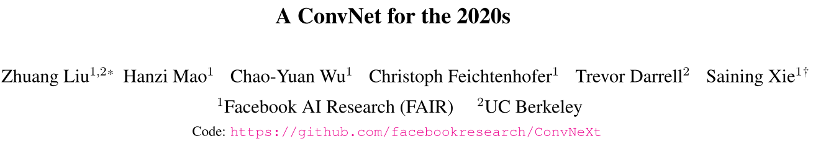
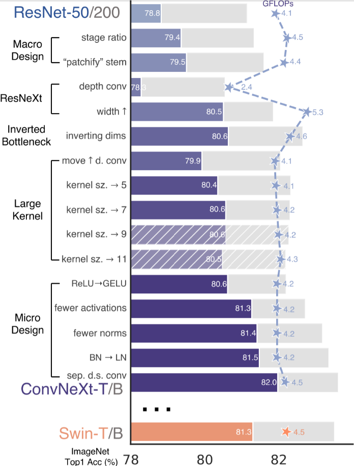
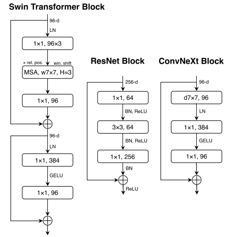
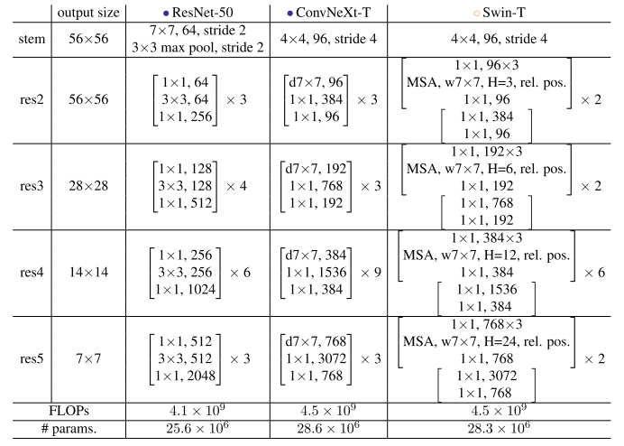

# ConvNeXt

> 卷积神经网络最后的荣光
>
> *ConvNeXt*是*FaceBook*于*2022*年在论文*A ConvNet for 2020s*中提出的，全文非常硬气的使用纯粹的卷积神经网络，希望曾经盛极一时的卷积神经网路能够重现往日的荣光。



---


## 1 模型创作背景

放眼整个神经网络在计算机视觉方面的进程，不外乎三个阶段：1. 全连接神经网络的探索期；2. 卷积神经网络的爆发期；3. 由*TransFormer*引起的大语言模型的改革期。

现在*21*世纪*20*年代，*VIT*的产生引起的神经网络在计算机视觉方面的应用朝着自注意力机制展开。曾经的*NLP*与*CV*是一门两家，但是现在这两个被巧妙的融合了起来。

正是如此，*VIT*基本上刷新了计算机视觉的各类榜单，它迅速的取代了传统的卷积神经网络，称为最先进的图像处理模型工具。

同年代，*Swin TransFormer*的出现打破了*VIT*模型架构在处理对象检测以及语义分割上面的诸多困难，称为了当时最强的架构，没有之一。

那么，在这个前提之下，卷积神经网络真的是一无是处吗？卷积神经网络在今后就没有超越*TransFormer*的可能性吗？基于此作者认为，纯粹的卷积神经网络依然由提升的空间，毕竟Swin TransFormer的一些设计也是向着卷积神经网络的思路来借鉴的，那么我们也可以借鉴一下人家的设计思路。



由此$ConvNeXt$就油然而生了

---


## 2 模型整体架构

卷积神经网络最强的一届大爆发显然就是*2016*年提出*ResNet*的那一次 ，因此本文就用*ResNet*作为基线并借鉴*Swin TransFormer*上面的一些想法对传统的*ResNet*网络架构进行修改，并将其命名为*ConvNeXt*来和当今最强大的神经网络架构*Swin TranFromer*扳扳手腕。

> ResNet是2016年提出的残差连接结构，使用短接的方式大大提高了模型的精度水平等等，成为了当时乃至现在最著名的一种网络架构。

### 2.1 宏观方面的改进

**改进一：**修改原本*ResNet*每一层的区块数量，原本的区块数量为$3:4:6:3$，改成现在的$3:3:9:3$。

> 原先的设计主要是基于经验注意的一种设计思路，因此这里借鉴了*Swin-T*中的比例$1:1:3:1$。并扩大3倍来进行现在的改进比例，防止和原本的差距过大产生奇怪的问题。

**改进二：**修改原本ResNet的初始主干结构，原本的进入网络前的结构为一层$7 \times 7$的卷积加上一个最大池化层来实现模型的下采样操作，现在改成了单个$4 \times 4$的卷积并且步长为$4$的卷积运算直接进行下采样

> 这个没有什么好说的，他这个就是模拟原本的*TransFormer*的一些思路进行的

### 2.2  ResNeXt-tify的改进

**改进三：**在深度卷积部分，不再使用原本的基本卷积操作，而是采用一种计算量更加低的深度可分离卷积来进行。

> 深度可分离卷积是*MobileNet-V1*中提出的一种卷积方式，它大大降低了普通卷积操作的运算量，但随之而来的确实精度的降低，不过计算量的下降实在是太多了，因此可以用它，并提高宽度，来拉高精度的同时降低计算成本。

**改进四：**使用深度可分离卷积的情况下提高模型的整体宽度。

### 2.3 卷积核的改进策略

**改进五：**将原本所谓的瓶颈结构，变成了倒瓶颈结构，也可以称之为倒残差结构。从原本的吸纳进行$1\times 1$降低维度后升高维度的操作，变成了现在的先进行$1\times 1$升高维度后降低维度的操作。

> 这个操作是借鉴了*MobileNet-V2*里面的到残差结构的思想

**改进六：**上拉原本的深度卷积核，从$1\times 1$卷积之后，放到了$1\times 1$卷积之前。

> 这个操作就是借鉴了*TransFormer*中的多头注意力位于*FeedForwad*也就是全连接网络前的这种思想

**改进七：**使用$7\times 7$的大卷积核来替换掉原本深度卷积的$3\times 3$的小卷积核。

> 这个操作是借鉴了*TransFormer*的注意力是全局注意力而非局部注意力的一种思想，试试看拉大卷积核的作用大不大。

### 2.4 微观层面上的改进

**改进八：**使用$GELU$激活函数来替换掉原本的$ReLU$激活函数。

> 没啥好说的应该就是试试看看效果如何，效果好就用上了。

**改进九：**减少激活函数以及归一化层的使用，同时使用单独的下采样层。

**改进十：**将原本的批量归一化$BN$变成了现在的层归一化$LN$。

> 这一块的具体改进论文中的附图非常好的显示出来了。
> 

经过这一系列的改进，原本的*ResNet*就焕然一新，重新成为现在的*ConvNeXt*了，他的精度甚至打败了当时最强的网络架构*Swin-T*。

> 从这里就可以看出来，大家只是站在巨人的肩膀上看世界，将前人厉害的思想，强大的智慧放在哪怕很多年前的事情上，也会有很多很好的效果。这个作者一定是时常积累的人。
>
> 哪有什么一蹴而就，不过是努力之后的水到渠成。

---


## 3 模型代码实现

这里我认为，代码的实现是一个非常好的复现工程，这个网络集合了前人的几乎所有智慧。

下面的表格中就是整体的模型框架图



首先就是导入具体的一些库，这里主要还是使用*Pytorch*模块的。

```python
import torch 
import torch.nn as nn
import torch.nn.functional as F
import torch.optim as optim
from torchvision import datasets, transforms
from torch.utils.data import DataLoader
import time
import math
import copy
import matplotlib.pyplot as plt
import numpy as np
import os 
from tqdm import tqdm
```

根据文章内容，最开始就要将原本的深度卷积换成所谓的深度可分离卷积。

```python
class DepthWiseConv(nn.Module):
    def __init__(self , in_channels , kernel_size , stride = 1 , padding = 0):
        super(DepthWiseConv , self).__init__()
        self.depthwise_conv = nn.Conv2d(
            in_channels = in_channels ,
            out_channels = in_channels ,
            kernel_size = kernel_size ,
            stride = stride ,
            padding = padding ,
            groups = in_channels,
            bias= False
        )
        self.pointwise_conv = nn.Conv2d(
            in_channels = in_channels ,
            out_channels = in_channels ,
            kernel_size = 1 ,
            stride = 1 ,
            padding = 0,
            bias = False
        )
    def forward(self , x):
        out = self.depthwise_conv(x)
        out = self.pointwise_conv(out)
        return out
```

其次建立单个*ConvNeXt*网络的基本块儿

```python
class ConvNeXt_Block(nn.Module):
    '''ConvNeXt的基本块'''
    def __init__(self , in_channels , stride=1 , feature_size = 224):
        super(ConvNeXt_Block , self).__init__()
        expansion = 4
        self.layer1 = DepthWiseConv(in_channels , kernel_size=7 , stride=1 , padding=3)
        self.layer2 = nn.LayerNorm(in_channels)

        self.layer3 = nn.Conv2d(in_channels , in_channels * expansion , kernel_size= 1 , padding= 0 , bias=False)
        self.gelu = nn.GELU()

        self.layer4 = nn.Conv2d(in_channels * expansion , in_channels , kernel_size=1 , padding=0 , bias = False)

    def forward(self , x):
        identity = x
        out = self.layer1(x)
        out = out.permute(0, 2, 3, 1)
        out = self.layer2(out)
        out = out.permute(0, 3, 1, 2)
        out = self.layer3(out)
        out = self.gelu(out)
        out = self.layer4(out)
        out = out + x
        return out
x = torch.randn(4 , 3 , 224 , 224)
models = ConvNeXt_Block(3 , stride=1 , feature_size=224)
out = models(x)
out.size()
```

然后定义单独的下采样层，方式通道数不对。

```python
class Downsample_Layer(nn.Module):
    def __init__(self, in_dims, out_dims):
        super().__init__()
        self.downsample = nn.Sequential(
            nn.LayerNorm(in_dims), 
        )
        self.conv = nn.Conv2d(in_dims, out_dims, kernel_size=2, stride=2)

    def forward(self, x):
        # 1. 调整维度以适配 LayerNorm: (N, C, H, W) -> (N, H, W, C)
        x = x.permute(0, 2, 3, 1)
        x = self.downsample[0](x)
        # 2. 转换回卷积格式: (N, H, W, C) -> (N, C, H, W)
        x = x.permute(0, 3, 1, 2)
        # 3. 执行下采样卷积
        x = self.conv(x)
        return x
```

最后就是*ConvNeXt*的整体网络架构实现

```python
class ConvNeXt_Net(nn.Module):
    def __init__(self , in_channels = 96 , num_classes = 1000):
        # 第1个改进层数的比例更改3:3:9:3
        super(ConvNeXt_Net, self).__init__()
        # 第2个改进使用4x4卷积替换掉原来的卷积加上池化处理
        # self.pre_downsample = nn.Conv2d(kernel_size=4 , stride = 4 , in_channels = 3 , out_channels = 96 , padding = 1)
        # 基于CIFAR-10数据集的图片大小32x32，所以这里改成2x2卷积替换掉原来的卷积加上池化处理
        self.pre_downsample = nn.Conv2d(kernel_size=2 , stride = 2 , in_channels = 3 , out_channels = 96 , padding = 0)
        self.layer1 = nn.Sequential(
            ConvNeXt_Block(in_channels , stride = 1 , feature_size = 224),
            ConvNeXt_Block(in_channels , stride = 1 , feature_size = 224),
            ConvNeXt_Block(in_channels , stride = 1 , feature_size = 224)
        )
        self.downsample1 = Downsample_Layer(in_dims=in_channels, out_dims=in_channels * 2)
        self.layer2 = nn.Sequential(
            ConvNeXt_Block(in_channels * 2 , stride = 1 , feature_size = 112),
            ConvNeXt_Block(in_channels * 2 , stride = 1 , feature_size = 112),
            ConvNeXt_Block(in_channels * 2 , stride = 1 , feature_size = 112)
        )
        self.downsample2 = Downsample_Layer(in_dims=in_channels * 2, out_dims=in_channels * 4)
        self.layer3 = nn.Sequential(
            ConvNeXt_Block(in_channels * 4 , stride = 1 , feature_size = 56),
            ConvNeXt_Block(in_channels * 4 , stride = 1 , feature_size = 56),
            ConvNeXt_Block(in_channels * 4 , stride = 1 , feature_size = 56),
            ConvNeXt_Block(in_channels * 4 , stride = 1 , feature_size = 56),
            ConvNeXt_Block(in_channels * 4 , stride = 1 , feature_size = 56),
            ConvNeXt_Block(in_channels * 4 , stride = 1 , feature_size = 56),
            ConvNeXt_Block(in_channels * 4 , stride = 1 , feature_size = 56),
            ConvNeXt_Block(in_channels * 4 , stride = 1 , feature_size = 56),
            ConvNeXt_Block(in_channels * 4 , stride = 1 , feature_size = 56)
        )
        self.downsample3 = Downsample_Layer(in_dims=in_channels * 4, out_dims=in_channels * 8)
        self.layer4 = nn.Sequential(
            ConvNeXt_Block(in_channels * 8 , stride = 1 , feature_size = 28),
            ConvNeXt_Block(in_channels * 8 , stride = 1 , feature_size = 28),
            ConvNeXt_Block(in_channels * 8 , stride = 1 , feature_size = 28)
        )

        self.layer5 = nn.Sequential(
            nn.AdaptiveAvgPool2d((1, 1)),
            nn.Flatten(),
            nn.Linear(in_channels * 8, num_classes)
        )
    def forward(self , x):
        out = self.pre_downsample(x)
        out = self.layer1(out)
        out = self.downsample1(out)
        out = self.layer2(out)
        out = self.downsample2(out)
        out = self.layer3(out)
        out = self.downsample3(out)
        out = self.layer4(out)
        out = self.layer5(out)
        return out 
```

