# 人工智能的全新范式*TransFormer*

> [!NOTE]
>
> *OK*学了这么就也该上点强度了，*TransFromer*是*Goolge*公司于*2017*在论文*Attention Is All You Need*提出的，顺便在说一句这个论文写的超级的不错，很值得仔细阅读。
>
> 这篇文章主要是为了解决大语言模型中的机器翻译的问题而提出的。

## 1 TransFormer是什么

在*TransFormer*提出之前在人们对机器翻译这个问题上面也是耗费了不少的心血，当时最棒的网络就是*RNN*循环神经网络以及*CNN*卷积神经网络(这个主要是图像处理方面的一些东西)。

## 2 TransFormer的整体架构

*TransFormer*就是非常直接的使用了一个全局注意力机制来进行机器翻译等问题。

TransFormer的整体也是由很多的块儿组成的，我们可以将它理解成几个编码块儿以及几个解码块儿，加上一组输入和一组输出，就这么几个东西，当然最重要的肯定是编码块儿以及解码块儿。

现在进行解读。这里用一个比较简单的例子进行解读：
将中文**“我喜欢水果”**翻译成英文**“I love fruits”**

### 2.1 TransFormer的输入部分

TransFormer的输入部分由两个结构组成分别是词编码以及位置编码。

#### 2.1.1 词编码

**首先**就是词编码部分，它将一句话中的每一个单词编辑成一个所谓的词向量，每个词语都编辑成一个向量，向量的长度肯定是看自己啦。

图片中表示的就是一个词语编码的例子，我们将每个**单词**都对应了一个$1\times 6$的行向量，每个行向量中保存了这个词语的词义等信息。

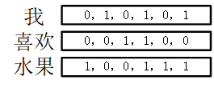

> 这里的词向量是用来保存这个单词的具体信息，虽然不知道是怎么保存的但是，就是存储成功了，词向量是通过训练得到的。

#### 2.1.2 位置编码

**其次**在这么一个句子中，他和卷积神经网络是完全不一样的，卷积神经网络是存在位置信息的，但是这个词语直接切开，天知道每个词语的前后是什么。但是在翻译过程中，如果你不知道前面后面的语境，那翻译的东西真的没法看。

因此需要对每个单词进行位置编码操作，也就是*Positional Encoding*。编码的方式这里采用的是正余弦的编码方式。
$$
PE_{(pos,2i)} = sin(\frac{pos}{1000^{2i/d_{model}}});  

PE_{(pos,2i+1)} = cos(\frac{pos}{1000^{2i/d_{model}}})
$$
其中$pos$表示的是第几个单词，$i$就是向量中的第几个位置，$d_{model}$就是向量的整体长度，那么对于上面那个例子就可以很简单的通过这个公式来表示一下他的位置编码向量了。

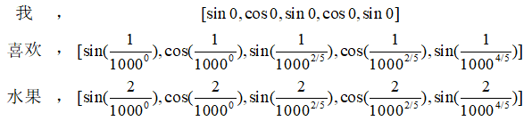

> 这么一顿推导就求得了他的位置编码如下图所示。

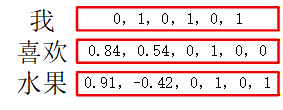

#### 2.1.3 输入矩阵

现在求得了词编码矩阵，以及位置编码矩阵，现在对这两个矩阵进行对应元素直接相加。

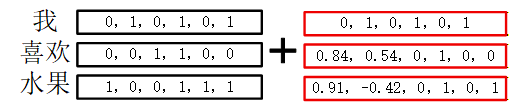

求得编码器的输入矩阵$X$。

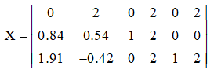

> 将词向量和位置向量直接相加，逐个元素对应相加，相加后的结果充当编码器的输入部分。

现在就得到了一个$3\times 6$的输入矩阵$X$。便可以进入下一步，也即是编码器的部分。

### 2.2 TransFormer的编码器

编码器的主要结构就是下面这个结构，主要包括了一个多头注意力模块，一个前馈函数模块，两个残差连接归一化模块。

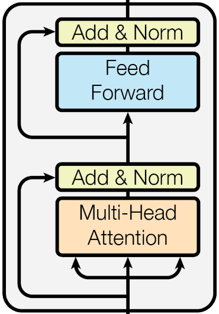

首先输入数据进入多头注意力机制模块，进行处理。

#### 2.2.1 自注意力机制模块

多头注意力机制模块的框图如下所示，其中的各种详情会逐步叙述

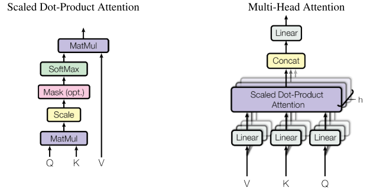

包括了位置信息以及词语本身信息的$3\times 6$大小的输入矩阵$X$输入到了多头注意力机制模块，其中多头注意力机制模块是三个单头注意力机制模块的合成体。

##### 2.2.1.1 单头注意力机制

首先对单头注意力机制模块进行讲解，假设单头注意力机制模块的输入为$3\times 2$大小的矩阵$X_i$，现在天生存在三个大小完全相同的矩阵分别是$W_Q,W_K,W_V$这三个矩阵的大小均为$2\times 2$，同时这三个矩阵分别对X做线性变换，一定是列变换而非行变换，不能把每个单词搞混了。

$\left\{ \begin{array}{l}
{{\rm{X}}_{iQ}} = {X_i} \times {W_Q}\\
{{\rm{X}}_{iK}} = {X_i} \times {W_K}\\
{{\rm{X}}_{iV}} = {X_i} \times {W_V}
\end{array} \right.$

这之后得到的三个矩阵一定是大小相等的三个矩阵，他们的大小均是$3\times 2$和原来保持不变。

> 这个线性变换的三个$W$矩阵均是通过深度学习的过程之中学习得到的数据，每个矩阵的数据都是先随机初始化，然后反向传播学习出来的，并非一开始就给定的。

而这三个得到的矩阵分别就对应了单头注意力的三个输入矩阵$Q，K，V$。

> 现在对这三个矩阵进行一些通俗的理解，也是用一个例子来说明一下，比方说这个单头注意力输入的单词是"水"。
>
> 那么$Q$也就是$Query$，好比是一个提问的试卷，它上面包含了很多问题，他会问道"你是不是物体？你是不是吃的？你是不是喝的？"这些问题。
>
> 而$K$也就是$Key$，好比是一个回答的关键词，当Q问道“你是不是吃的？”这个时候Key就是回答“yes或者no”。
>
> 而$V$也就是$Value$，就非常基本的表示这个的具体数据。没啥好说的

有了这三个矩阵之后便进入倒第一个操作也就是Q和K之间相关性质的判定了，这个判定非常简单，就是矩阵相乘向量内积的感觉。

$number = QK^T$

> 还是一样用上面的那个例子说一下，如果我的输入是水，并且Q发问“你是不是吃的？”这个时候Key就是回答“yes”，那么数据会较低一些，反之则反之。

$Q$和$K$均是一个$3\times 2$大小的矩阵，那么经过转职后相乘，他的结果就是一个$3\times 3$大小的矩阵。这个矩阵里面就包含了这两个矩阵相似度的信息。而这个事情就是进行一个打分看看水究竟和那种类型的意思更加的接近一些。用下面的矩阵可能会很好理解。

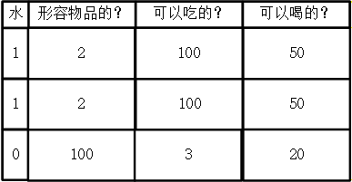

> 矩阵搞定之后得到的结果可以说是一个分数罢了，分数越高越匹配，当然实际的TransFormer的东西肯定不仅仅只有这么一些东西，它是更加的多维度发问

但是分数这么高在进行学习的过程中非常容易出现问题，尤其是在归一化的时候，人们发现，K的维度大小会十分显著的影响分数的高低，因此需要对这个矩阵进行缩放，那么缩放的方法也是超级简单的，直接除以$\sqrt{\rm{dK}}$即可实现效果比较好的缩放。

那么现在他的公式就发生了第二次演化。

$number = \frac{QK^T}{\sqrt{dK}}$

这样子就实现了缩放以及基本的寻找，但是这个缩放后的东西直接放进原本的网络模型中进行训练，数据肯定是不对的，必须要进行一下归一化的操作，因此这里对每一行，也就是每一个$K$都进行$Softmax$操作，实现归一化

$number = Softmax(\frac{QK^T}{\sqrt{dK}})$

这之后就可以放进网络之中进行训练，最后在将原本的所表示的具体数据Vlaue放进来就实现了整整的单头注意力的全部实现。

$Attention =Softmax(\frac{QK^T}{\sqrt{dK}})V $

很巧合的最后的输出矩阵还是和输入矩阵相同的维度，也是$3\times 2$大小的一个矩阵。那么至此单头注意力就实现成功了。

> 单头注意力机制的整体思路和之前的注意力机制思路基本一致，首先求解出每个意思对应的权重大小，然后再将这个权重大小和真正的意思相乘，求得权重最大的那个意思即可。

那么为什么会引入多头注意力机制呢？这究竟是什么东西？相较于单头注意力机制效果涨了几何？

##### 2.2.1.2 多头注意力机制模块

单头注意力很好，但是它仅仅也只是一个人呀，真所谓三个臭皮匠顶的过一个诸葛亮。因此团队是非常重要的，考虑到这个因素，便发明了多头注意力机制，作者希望每个头都专攻一个方向。

> 有的头主要是对名词这块进行处理，有的头主要处理形容词，等等。这么多头处理完毕之后再合成，实现比较好的效果。

现在就用之前的我喜欢水果一例来说一说什么是多头注意力机制模块吧。

之前再输入部分已经确定了，咱们的输入矩阵是一个带着位置信息和词语信息的一个$3\times 6$大小的矩阵。那么多头多头，首先肯定要先分开各自输入到每个头之内把，因此这里使用的也是一个基本的线性变换，我们由三个矩阵分别是$W_1,W_2，W_3$这三个矩阵的大小完全相同均是$6\times 2$大小的矩阵。那么用这三个矩阵对数据矩阵进行线性列变换就得到了三个注意力头的输入矩阵$X_1,X_2,X_3$了，这里每个$X_i$的大小都是$3\times 2$的。

$
\left\{ \begin{array}{l}
{X_1} = X \times {W_1}\\
{X_2} = X \times {W_2}\\
{X_3} = X \times {W_3}
\end{array} \right.$

> 是不是和上面的单头注意力机制的$X_i$呼应上了吧！
>
> 这里的W们也是训练得到的三个矩阵，没啥好说的。

然后分别通过单头注意力机制模块输入各自输出一个矩阵，每个矩阵的大小是$3\times 2$的矩阵，总共得到这样相同的三个矩阵，分别是$out_1,out_2,out_3$。

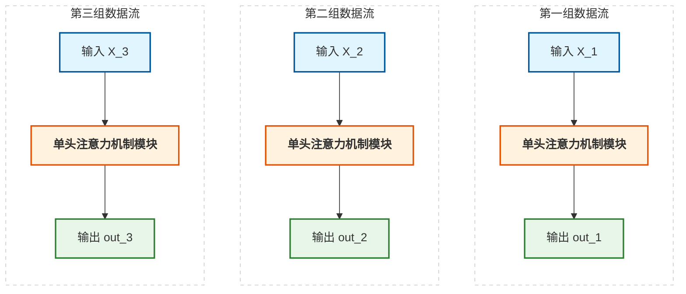

有了这三个表征不同类型特征的矩阵之后，就需要对着三个矩阵进行合成，这里的合成方法是耳熟能详的*Concat*方法，如下图所示。

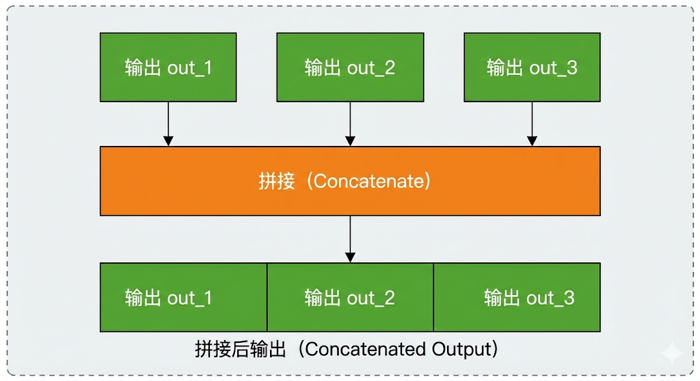

拼接后得到的矩阵是一个更大的矩阵，矩阵的大小是$3\times 6$。也就是经过concat拼接操作后得到的矩阵，现在进行一次线性变换就得到了多头注意力真正的输出。

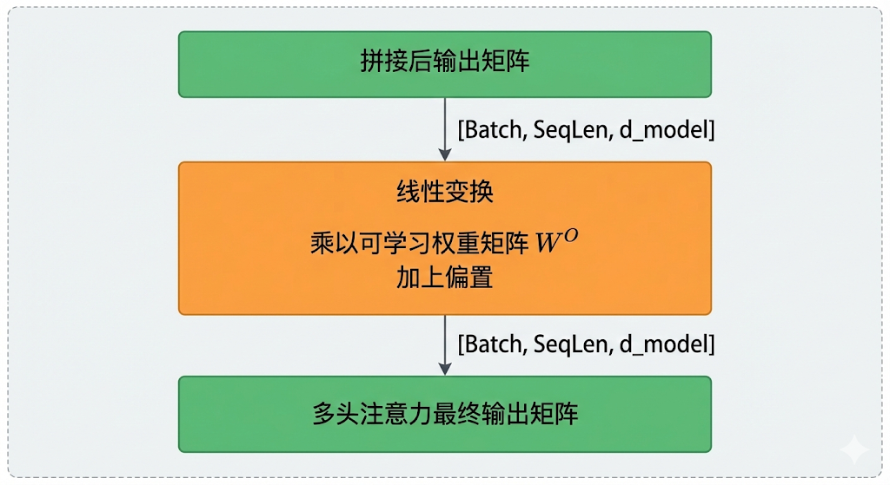

其中经过线性变换过程中的矩阵为$W^o$这个矩阵的大小也是一个$6 \times 6$大小的矩阵，经过这个矩阵后将原本的这个矩阵就进行特征融合的操作，最后就获得了一个和输入矩阵维度完全相同的一个矩阵。

最后输出的矩阵大小为$6\times 6$和输入矩阵的大小完全相同，同时这个矩阵就是多头注意力机制的输出矩阵，我们将这个矩阵命名一下称作$Attention output$。

#### 2.2.2 $Add＆Norm$模块

