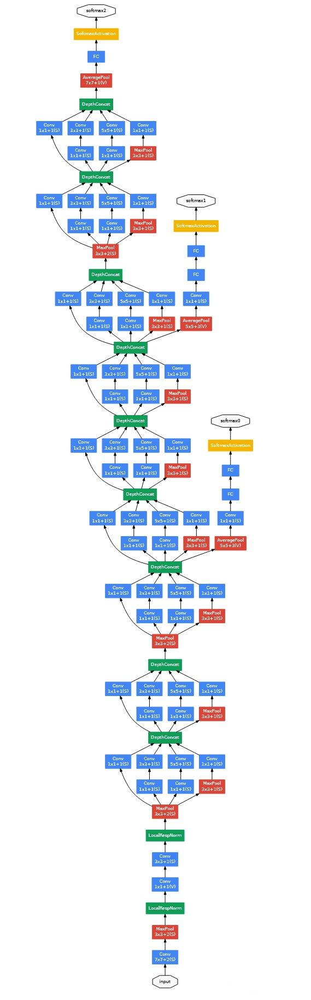

# GoogleNet

> [!NOTE]
>
> *GoogleNet*是*Google*公司于2014年在论文*Going Deeper with Convolutions*中提出的。
>
> 他的网络架构可以说是开创新的一种网络架构，不仅仅是前一代*NIN*网络的延续同时也是神经网络模型在宽度方面开枝散叶的第一人。是神经网络向着宽度领域迈出的一大步。

---


---


## 1 模型设计背景

*2014*年前后那个时代应该说是卷积神经网络大爆发的一个时代，各种新点子层出不穷，人们在目标检测以及分类工作上取得了巨大的成功。

> 在论文中也提到了“现在的目标检测和目标分类的任务获得如此好的效果不仅仅归功于好的硬件，大的数据集等；最主要的还是大家的想法，算法，模型等的创新”

当时的阶段人们在提高神经网络模型效果主要是采用两种方式：

1. 提高网络层数-深度
2. 提高单层网络的通道数量-宽度

> 
>
> 上面的图片可以看成是一个神经网络系统模型。
>
> 宽度就是单个层最大的红色圈圈的数量，也就是有几行。
>
> 深度就是总共的层数，也就是有几列。

但是如果仅仅一味的提高模型深度会导致训练的参数量过大，出现过拟合的现象；同时不断地拉高宽度会导致模型的计算量过大，造成计算资源的极大浪费。

因此趁着*2014* 年 *ImageNet* 大规模视觉识别挑战赛 *(ILSVRC14)*开赛的关节之上，Google公司带着他的巨作*GoogleNet*来了。

该网络整体采用分支的结构，在增强特征融合以及信息采集的同时降低计算量。

并且在前人*NIN*网络的启发之下，非常启发性的使用*1×1*的卷积神经网络不仅仅为了一部分的特征提取，更为了使用它来降低运算过程中的维度过大的问题。

另外在*VGG*和*NIN*的启发之下，也使用了一种块而来完美的集成在网络之中。可以说是卷**积神经网络中的卷积神经网络**了。

> 站在当时的角度想一想看，这个GoogleNet主要就是解决了当时的其中的几个问题，并且将之前人们模型的好处进行了提取，融入自己的同时发散思维大力创新。

---


## 2 模型整体框架

这个模型最重要的我认为并不是他的整体架构是如何设计的，更重要的是其中一个模块的设计，在论文中对该模块的命名为*Inception*这个模块也是整个模型最重要的创新点。

现在对该模块进行剖析。*Inception*模块如下图所示


首先偏向理性的对这个模块进行说明：这个模块的信息流流向是**从下到上**的上一步骤的图片进入的模型之中形成产生了四个分支，从左往右分别为：

1. $1\times 1 $大小的一次小型卷积操作；
2. 先进行$1\times 1 $大小的一次小型卷积操作，然后进行$3\times 3 $大小的一次中型卷积操作；
3. 先进行$1\times 1 $大小的一次小型卷积操作，然后进行$5\times 5 $大小的一次大型卷积操作；
4. 先进行$3\times 3 $大小的一次最大池化操作，然后进行$1\times 1 $大小的一次小型卷积操作；

每个分支操作完毕之后，得到了四组矩阵然后将这四组矩阵进行拼接即可得到模块的输出。

那么为什么要这么设计呢，现在用偏向感性的想法进行思考，可能有点不对，但应该有助于理解吧。

1. 左侧蓝色的$1\times 1 $大小的一次小型卷积操作，在这个分支$1\times 1 $的卷积核有了**第一个**用处，这个东西是可以实现跨通道融合的一个事情。实际上它可以用一个公式表示一下$Y_{c_out,h,w} = Σ_{c_in=1}^{C_in} W_{c_out,c_in} · X_{c_in,h,w} + b_{c_out}$这个的本质其实就是，基本卷积运算。这个操作就想到把各个通道融合在一起做了一件事情。

    > 相当于对输入的图片做了通道处理，以及特征重组操作，并没有对空间做事情。
    >
    > 这里也可以说，小的视野关注小的物体，主要就是为了较小目标的识别

2. 第二个分支也就是中间的先*1*后*3*.这里的*1×1*卷积的目的已经不再是为了进行通道混合出特征了，而是为了降低维度也就是降低通道数，降低后续*3×3*的计算量。

    > 这里也可以说，中等目标关注的就是中等目标的事情

3. 第三个分支与第二个分支有异曲同工之妙。只不过换个大视野的玩意儿罢了

4. 第四个分支先进行最大池化，然后进行*1×1*的卷积操作。池化就两个事情，第一个下采样，找到最显著的特征，第二个降低空间尺寸大小。*1×1*卷积就不再多说了也是老生常谈的更改维度的作用。

> 这就是*Inception*整体模块的一些事情他其实就是在一个模块中探索多种可能行，用不同的视野不同的方式来看世界
>
> 可谓是优雅

到这里*GoogleNet*的最值得说的也就说完了。他的整体框架就放在下面，可以复现一下试试效果。


---


## 3 代码实现

首先就是*Inception*的代码实现

```python
import torch 
import torch.nn as nn

class InceptionBlock(nn.Module):
    '''Googlenet 的 Inception 模块
    Args:
        in_channels: 输入的通道数
    Returns: 
    '''
    def __init__(self , in_channels , out_1x1 ,  out_3x3_reduce , out_3x3 , out_5x5_reduce , out_5x5 , out_pool_proj):
        super(InceptionBlock, self).__init__()
        '''inception 模块包含四个并行的分支：
            Args:
                in_channels: 输入的通道数
                out_1x1: 1x1 卷积层输出的通道数
                out_3x3_reduce: 3x3 卷积层前的降维 1x1 卷积层输出的通道数
                out_3x3: 3x3 卷积层输出的通道数
                out_5x5_reduce: 5x5 卷积层前的降维 1x1 卷积层输出的通道数
                out_5x5: 5x5 卷积层输出的通道数
                out_pool_proj: 池化层后 1x1 卷积层输出的通道数 
        '''

        # 1x1 卷积层
        self.branch1x1 = nn.Sequential(
            nn.Conv2d(in_channels = in_channels , out_channels = out_1x1 , kernel_size = 1),
            nn.BatchNorm2d(out_1x1),
            nn.ReLU(inplace=True)
        )

        # 3x3 卷积层
        self.branch3x3 = nn.Sequential(
            nn.Conv2d(in_channels = in_channels , out_channels = out_3x3_reduce , kernel_size=1), # 用1x1 卷积进行降维
            nn.BatchNorm2d(out_3x3_reduce),
            nn.ReLU(inplace=True),
            nn.Conv2d(in_channels = out_3x3_reduce , out_channels = out_3x3 , kernel_size=3 , padding=1),
            nn.BatchNorm2d(out_3x3),
            nn.ReLU(inplace=True)
        )

        # 5x5 卷积层
        self.branch5x5 = nn.Sequential(
            nn.Conv2d(in_channels = in_channels , out_channels = out_5x5_reduce , kernel_size=1), # 用1x1 卷积进行降维
            nn.BatchNorm2d(out_5x5_reduce),
            nn.ReLU(inplace=True),
            nn.Conv2d(in_channels = out_5x5_reduce , out_channels = out_5x5 , kernel_size=5 , padding=2),
            nn.BatchNorm2d(out_5x5),
            nn.ReLU(inplace=True)
        )

        # 最大池化层
        self.poolbranch = nn.Sequential(
            nn.MaxPool2d(kernel_size=3 , stride=1 , padding=1),
            nn.Conv2d(in_channels = in_channels , out_channels = out_pool_proj , kernel_size=1),
            nn.BatchNorm2d(out_pool_proj),
            nn.ReLU(inplace=True)
        )
        
    def forward(self , x):
        branch1x1 = self.branch1x1(x)
        branch3x3 = self.branch3x3(x)
        branch5x5 = self.branch5x5(x)
        branchpool = self.poolbranch(x)

        out = torch.cat([branch1x1 , branch3x3 , branch5x5 , branchpool], dim=1) # (batch_size, channels, height, width) ,channels维度拼接

        return out
```

再来就是基于原论文的*GoogleNet*代码框架实现

```python
import torch 
import torch.nn as nn

class GoogleNet(nn.Module):
    def __init__(self , num_classes=1000):
        super(GoogleNet , self).__init__()
        '''Googlenet 网络结构
        '''
        self.googleNet = nn.Sequential(
            nn.Conv2d(in_channels = 3 , out_channels = 64 , kernel_size = 7 , stride = 2 , padding = 3),
            nn.BatchNorm2d(64),
            nn.ReLU(inplace=True),
            nn.MaxPool2d(kernel_size=3 , stride=2 , padding=1),

            nn.Conv2d(in_channels = 64 , out_channels = 192 , kernel_size = 3 , stride = 1 , padding = 1),
            nn.BatchNorm2d(192),
            nn.ReLU(inplace=True),
            nn.MaxPool2d(kernel_size=3 , stride=2 , padding=1),

            InceptionBlock(192 , 64 , 96 , 128 , 16 , 32 , 32),#3a
            InceptionBlock(256 , 128 , 128 , 192 , 32 , 96 , 64),#3b
            nn.MaxPool2d(kernel_size=3 , stride=2 , padding=1),

            InceptionBlock(480 , 192 , 96 , 208 , 16 , 48 , 64),#4a
            InceptionBlock(512 , 160 , 112 , 224 , 24 , 64 , 64),#4b
            InceptionBlock(512 , 128 , 128 , 256 , 24 , 64 , 64),#4c
            InceptionBlock(512 , 112 , 144 , 288 , 32 , 64 , 64),#4d
            InceptionBlock(528 , 256 , 160 , 320 , 32 , 128 , 128),#4e
            nn.MaxPool2d(kernel_size=3 , stride=2 , padding=1),

            InceptionBlock(832 , 256 , 160 , 320 , 32 , 128 , 128),#5a
            InceptionBlock(832 , 384 , 192 , 384 , 48 , 128 , 128),#5b

            nn.AdaptiveAvgPool2d((1,1)),    
            nn.Dropout(0.4),
            nn.Flatten(),
            nn.Linear(1024 , num_classes)
        )
    def forward(self , x):
        return self.googleNet(x)
```

*GoogleNet*的代码是依据上面的表格的，这个相关的流程图也放一下吧。

> 实在是太长了




