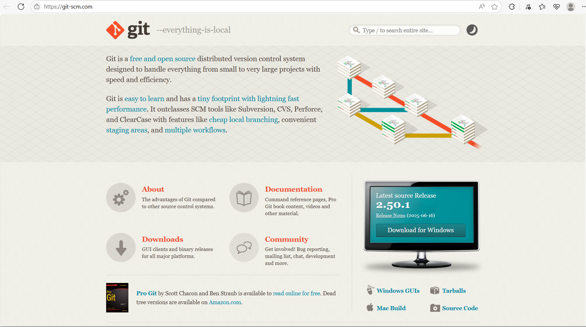
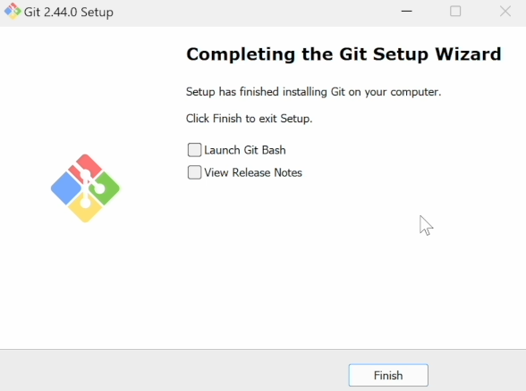

# 0 引言
对于一名有大量代码存储需求的人而言，一个比较好的存储习惯是至关重要的，一般来说我们都是采用本地存储的策略进行存储，且大多数时候主要是只保存最新版本也就是将老版本直接删掉了，并不会出现保存许多版本的情况，但是当某个瞬间需要前几次的版本的时候会非常的难受，因此一个良好的本地文档保存策略就显得极为重要。
而**git**这个**软件**便是用来最你的文件进行版本化的管理以及分布式的存储。
对于重要的文件而言，肯定是需要多个位置的保存，因此我们这里便采用国内比较好用的**gitee**进行远程代码存储管理策略。
# 1 git的下载、安装、配置
## 1.1 git的下载
首先我们需要清楚一个事情**git**这个玩意儿是一个**软件**而非名词。
1. 首先点击下方git下载链接进入到git的官网，[git下载链接](https://git-scm.com/)。进入链接后应该是下面的图像。
2. 点击下方的DOwnloads按钮，如下图所示。
![!\[\[Pasted image 20250715101944.png\]\]](https://i-blog.csdnimg.cn/direct/632074071ec247948b57ad6e2daf98f7.png)

3. 进入新的页面后点击windows按钮
![!\[\[Pasted image 20250715102141.png\]\]](https://i-blog.csdnimg.cn/direct/d324c46010d948a1932cc3a36b0ff9c0.png)

4. 现在大部分的电脑应该都是64位的电脑了因此选择X64的选项进行下载
![!\[\[Pasted image 20250715102241.png\]\]](https://i-blog.csdnimg.cn/direct/c57e32cd620c44dab62d61242fa8a16d.png)

5. 由于是外国的软件可能下载比较缓慢需要等一等。
![!\[\[Pasted image 20250715102349.png\]\]](https://i-blog.csdnimg.cn/direct/86646b6400e14d16bc959138cf47d06b.png)


## 1.2 git的安装
6. 下载完毕后，进入下载文件所在的当前文件夹，双击安装文件进行安装，下面选择的是**yes**，点击即可。
![!\[\[Pasted image 20250715102534.png\]\]](https://i-blog.csdnimg.cn/direct/f399dd853aa44065a44312173e251b9e.png)

7. 下面这个协议点击**next**
![!\[\[Pasted image 20250715102719.png\]\]](https://i-blog.csdnimg.cn/direct/337d7f76e77a40a9bee93a4aef81de25.png)

8. 重新选择安装的路径，尽可能不要选择C盘。点击**Browse**进行路径选择即可。修改完毕后点击**next**进入下一步
![!\[\[Pasted image 20250715102847.png\]\]](https://i-blog.csdnimg.cn/direct/23847682097a42a0882089f1643a8d5d.png)

9. 这个地方不要管，直接点击**next**就好了
![!\[\[Pasted image 20250715103247.png\]\]](https://i-blog.csdnimg.cn/direct/fe43897659d4459faf548d9476775e8a.png)

10. 这个地方也保持默认，一直点击**next**就可以了
![!\[\[Pasted image 20250715103332.png\]\]](https://i-blog.csdnimg.cn/direct/1cd16dc578a04674a9b1d4cb5d5d1a07.png)

11. 这里进入下拉菜单选择**VSCODE**即可，选择完毕后再次点击**next**。
![!\[\[Pasted image 20250715103421.png\]\]](https://i-blog.csdnimg.cn/direct/74bfd2a653a04dd69867a949ffac1793.png)

12. 选择第二个选项。选完后点击**next**。
![!\[\[Pasted image 20250715103512.png\]\]](https://i-blog.csdnimg.cn/direct/65b54f3cdaae47488f5ed1d024f90e38.png)

13. 保持默认**next**
![!\[\[Pasted image 20250715103610.png\]\]](https://i-blog.csdnimg.cn/direct/474b2e206cae4a96a76a9e953fa3adac.png)

14. 一直**next**。
![!\[\[Pasted image 20250715103635.png\]\]](https://i-blog.csdnimg.cn/direct/dcbd633cea6e49bf95e13f9f6dc5c324.png)

15. **next**
![!\[\[Pasted image 20250715103705.png\]\]](https://i-blog.csdnimg.cn/direct/886b418d89244d84a1614e587bb517f4.png)

16. **next**
![!\[\[Pasted image 20250715103723.png\]\]](https://i-blog.csdnimg.cn/direct/91db8769c236470fbff55c8209b46a75.png)

17. 这里选择是第二个用windows自带的哈，选完后继续**next**
![!\[\[Pasted image 20250715103810.png\]\]](https://i-blog.csdnimg.cn/direct/6cd0c2934e83415bbf537b92140b1191.png)

18. next就完了
![!\[\[Pasted image 20250715103932.png\]\]](https://i-blog.csdnimg.cn/direct/c463749f398646c881bba2dfec4c72e0.png)
19. NEXt好了之后点击install进行软件的安装。
![!\[\[Pasted image 20250715104043.png\]\]](https://i-blog.csdnimg.cn/direct/6941f85ffa804f11a9284f90df24bd4e.png)

	![!\[\[Pasted image 20250715104055.png\]\]](https://i-blog.csdnimg.cn/direct/932dca368c5042c6bffddb0a7f514ac1.png)

20. 稍等片刻后git便安装完毕，点击finish就可以啦。至此
![!\[\[Pasted image 20250715104150.png\]\]](https://i-blog.csdnimg.cn/direct/ef1aa1a7848340c389f3f9d10a67b16a.png)

	
至此git软件便已经安装完毕了。
后面便进入git的配置环节。

# 2 vscode的下载、安装、配置
## 2.1 Vscode的下载以及安装
由于vscode的安装以及下载的难度不高这里就不再多做说明了，我就放一下链接也是**其他的大神出的博客**即可
1. [Visual Studio Code 下载链接](https://code.visualstudio.com/)
2. [vscode安装+配置+使用+调试](https://blog.csdn.net/weixin_60915103/article/details/131617196?ops_request_misc=%257B%2522request%255Fid%2522%253A%252296902086dbb5898199587aac571db9da%2522%252C%2522scm%2522%253A%252220140713.130102334..%2522%257D&request_id=96902086dbb5898199587aac571db9da&biz_id=0&utm_medium=distribute.pc_search_result.none-task-blog-2~all~top_positive~default-1-131617196-null-null.142^v102^pc_search_result_base7&utm_term=vscode%E5%AE%89%E8%A3%85&spm=1018.2226.3001.4187)
## 2.2 vscode本地仓库-git的配置
1. 打开**vscode**软件里面应该啥都没有。
![!\[\[Pasted image 20250716103442.png\]\]](https://i-blog.csdnimg.cn/direct/4322e5f99eb742faa39c11c87f514fa1.png)

2. 我们现在自己的本地建一个文件夹，作为这个**项目**使用的文件夹。我这里就在桌面建了。
![!\[\[Pasted image 20250716103625.png\]\]](https://i-blog.csdnimg.cn/direct/29e87a80559b4dd98841f8e7f578fc7b.png)

3. 记住这个文件夹所在的位置你可以保存这个文件夹的目录位置。
双击打开你新建的文件夹后，单机一下上面的白条就看到了。我的目录位置便是。
```
E:\UserData\Desktop\test     
```
![!\[\[Pasted image 20250716103821.png\]\]](https://i-blog.csdnimg.cn/direct/4a1b15bfbe81451a8a9f42430695008f.png)

4. 重新回到vscode软件中，按照下面的操作将文件夹导入到vscode中。
左上角单机**文件**，选择**打开文件夹**
![!\[\[Pasted image 20250716104156.png\]\]](https://i-blog.csdnimg.cn/direct/8e9383a15b884849875e42839ab0b74f.png)

选择那个之前新建的文件夹后点击选择文件夹即可。
![!\[\[Pasted image 20250716104310.png\]\]](https://i-blog.csdnimg.cn/direct/ae2f98458e3e4e72b7c3cfcc96e6040f.png)

选择好后就导入进来了。
![!\[\[Pasted image 20250716104327.png\]\]](https://i-blog.csdnimg.cn/direct/f021d05b763143409d1d32c29744fb03.png)

5. 新建一个任意的文件作为测试文件。我这里建的是一个md的文档
![!\[\[Pasted image 20250716104426.png\]\]](https://i-blog.csdnimg.cn/direct/dfe8b7d580b8467abe7566a78c03020b.png)

6. 在新建的文档里面输入一些信息，并单机**Ctrl+S**进行保存
![!\[\[Pasted image 20250716104659.png\]\]](https://i-blog.csdnimg.cn/direct/21a29302fca048fc8045435b6512106f.png)

7. 单机左侧的源代码管理，并初始化仓库。
![!\[\[Pasted image 20250716104759.png\]\]](https://i-blog.csdnimg.cn/direct/112812531a1c439c9d41d21e8799ddf1.png)

8. 在这个方框里面输入版本号并提交，就算是将代码提交到本地的一个仓库之中了。
![!\[\[Pasted image 20250716104927.png\]\]](https://i-blog.csdnimg.cn/direct/0c87f9b923f843539caeecde889ea3e2.png)

	![!\[\[Pasted image 20250716104950.png\]\]](https://i-blog.csdnimg.cn/direct/ba8ee0e97c884cfd99b23f200c9755bf.png)

9. 单机左侧的三个小点添加远程存储。
![!\[\[Pasted image 20250716105027.png\]\]](https://i-blog.csdnimg.cn/direct/16b5aff8345c42f2b8749d0bea61f778.png)

10. 在上面输入你的远程仓库的URL即可。
这里远程仓库的URL的拿到我们主要采用的是gitee进行使用，因为github有点卡比较麻烦，所以采用gitee做示范不过本质是一样的。具体见第三段的说明。
[[#3 gitee远程仓库的建立、配置]]
![!\[\[Pasted image 20250716105103.png\]\]](https://i-blog.csdnimg.cn/direct/3054f4b6f00944389edc844edcd0183f.png)

11. 链接到远程仓库后重新点击提交代码
![!\[\[Pasted image 20250716105246.png\]\]](https://i-blog.csdnimg.cn/direct/09d8f193edb8440c8b572d2e0ad9003a.png)

12. 当出现同步更改字样的时刻说明已经和你的远程仓库完成了链接，点击同步更改你的代码便提交到了远程仓库中。
![!\[\[Pasted image 20250716105344.png\]\]](https://i-blog.csdnimg.cn/direct/69eb12115dbf43fdb9f2e78ee706c4e6.png)

# 3 gitee远程仓库的建立、配置
1. 作为一个国内特别火热的远程代码仓库2我想gitee是非常不错的。用他的主要原因是因为**不卡**。
2. 首先进入[Gitee官网](https://gitee.com/)，如果有账号登录就可以了，如果没有账号那就注册账号，这个就不多说了，登录注册完毕进入网站主页。 ![!\[\[Pasted image 20250716110301.png\]\]](https://i-blog.csdnimg.cn/direct/4d1f4c9f1b6143098572668344711d2e.png)

3. 点击右侧的加号按钮新建一个仓库仓库的新建方法就不说了这个比较简单![!\[\[Pasted image 20250716110417.png\]\]](https://i-blog.csdnimg.cn/direct/a00c9a2bf6704eb291c6163e1f183c1c.png)

4. 点击克隆和下载按钮![。!\[\[Pasted image 20250716110751.png\]\]](https://i-blog.csdnimg.cn/direct/245862138cb145da886dbe8e5645d922.png)
上面这个第一行的就是所谓的URL把这个复制到vscode之前的对话框中便可以了。
5. 下面的配置我想也是很重要的，那个用来识别自己的身份信息之类的还是蛮重要的将这行代码复制到VScode下面的终端中回车就可以了。
至此便完成了代码的上传和下载。