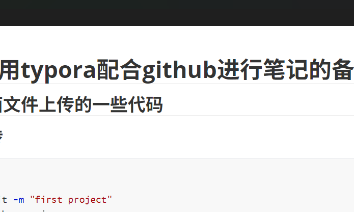

# 尝试采用typora配合github进行笔记的备份操作

## 1.git上面文件上传的一些代码

### 1.首次上传

```bash
git init 
git add . 
git commit -m "first project"
git branch -m main
git remote add origin https://github.com/sxq12320/typora_book.git
git push -u origin main
```

### 2.下次上传

```bash
git add .
git commit -m "first project"
git push -u origin main
```

# 2.对有道云笔记的移值

