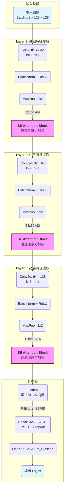

# 中文

## 0 引言

该代码库主要由两个分支组成。首先是`main`分支，该分支目前已基本停用。但由于我当前的技术限制，未能及时移除这个分支。另一个`master`分支则是我现在用作主要开发维护的核心分支。

建立这个代码库的主要目的，是借助Git的版本控制和托管功能，将我的学习笔记与思考全面存储在GitHub上。库中所有笔记均采用Markdown语法撰写，内容涵盖但不限于深度学习笔记、个人日志、工作实践技巧以及开源视频制作与分享笔记。其中最具价值的组成部分，当属我对深度学习的思考与见解。现在，请开始探索我的代码库吧。

首先请允许我使用一段话来介绍一下各个文件夹中包含的内容，主要做了些什么，究竟有什么用处。

## 1 DeepLearning

该文件夹主要包含了我的深度学习有关的学习笔记，今后会持续进行更新。

## 2 someTips

该文件夹里面主要包含了一些软件操作，环境配置等问题

## 3 OpenProject

该文件夹里面主要包括了我在bilibiil上面的视频开源问题的笔记，里面可能容纳了很多的代码以及相对应的视频脚本等。

## 4 电脑重要软件列举

> 现在将电脑中所有已经安装的软件进行一个说明。

|           应用名称            |                           应用图标                           |             主要用途             |
| :---------------------------: | :----------------------------------------------------------: | :------------------------------: |
| `Adobe Acrobat Distilleer DC` |  |          用于PDF的查看           |
|     `Adobe After Effects`     |  |       用于制作动画以及特效       |
|      `Adobe Illustrator`      |  |        用于设计制作矢量图        |
|       `Adobe Photoshop`       |  |       用于位图的设计和制作       |
|     `Adobe Premiere Pro`      |  |     用于对视频进行剪辑和处理     |
|     `Anaconda Navigator`      |  |       用来配置python的环境       |
|           `AutoCAD`           |  |        二维图纸的设计制作        |
|       `Autodesk Fusion`       |  |        三维建模的一个软件        |
|           `AxMath`            |  |      用来生成数学公式的软件      |
|          `阿里云盘`           |  |          这个就不多说了          |
|          `暴雪战网`           |  |     这个就是暴雪的游戏下载器     |
|          `百度网盘`           |  | 这个也不多说了，老生常谈的东西啦 |
|         `Clash Verge`         |  |     这个不能多说，魔法软件吧     |
|            `地图`             |  |        就是自带的地图软件        |
|         `电影和电视`          |  |     一个非常经典的视频播放器     |
|         `Everything`          |  |       用于搜索电脑内文件的       |
|            `Excel`            |  |        经典的数据处理软件        |
|         `foobar 2000`         |  |          用来播放音乐的          |
|             `Git`             |  |        非常重要的仓库软件        |
|            `Clion`            |  |            写c语言的             |
|           `PyCharm`           |  |            写python的            |
|          `嘉立创EDA`          |  |            绘制PCB的             |
|          `夸克网盘`           |  |             不在多说             |
|       `Microsoft Edge`        |  |        微软的浏览器自带的        |
|           `MikTeX `           |  |            latex环境             |
|         `Nsts2 Msys`          |  |        用于配置C语言环境         |
|             `OBS`             |  |         直播以及电脑录屏         |
|                               |                                                              |                                  |

---

# English

## 0 introduction

This repository primarily consists of two branches. The first, the `main` branch, has largely fallen into disuse. However, due to my current technical limitations, I have been unable to remove this branch promptly. The other branch, `master`, is the one I currently use as the primary branch for active development and maintenance.

The primary purpose of establishing this repository was to leverage Git's version control and hosting capabilities to comprehensively store my notes and reflections on GitHub. All notes within this repository are authored using Markdown syntax. The content includes, but is not limited to, notes on deep learning, personal journal entries, practical work-related tips, and notes on creating and sharing open-source videos. The most significant component, I would say, consists of my reflections and insights on deep learning. Now, please feel free to begin exploring my repository.

First, allow me to use a brief paragraph to introduce the contents of each folder, what they primarily contain, and their practical purposes.

## 1 DeepLearning

This folder primarily contains my study notes related to deep learning, which will be continuously updated in the future.

1. Lecture notes from Professor Li Mu's "Dive into Deep Learning" course.

## 2 someTips

This directory mainly comprises software operation guides and environment configuration documentation.

## 3 OpenProject

This folder primarily consists of notes regarding my open-source video projects on Bilibili, potentially including substantial code implementations and corresponding video scripts.

Of course. Here is the official and standardized English translation of the provided software list.

***

## 4 List of Essential Installed Software

> The following is a description of all software currently installed on the computer.

| Application Name               | Application Icon                                             | Primary Purpose                                              |
| :----------------------------- | :----------------------------------------------------------- | :----------------------------------------------------------- |
| **Adobe Acrobat Distiller DC** |  | For viewing and processing PDF files.                        |
| **Adobe After Effects**        |  | For creating motion graphics and visual effects.             |
| **Adobe Illustrator**          |  | For vector graphics design and creation.                     |
| **Adobe Photoshop**            |  | For raster image design and editing.                         |
| **Adobe Premiere Pro**         |  | For video editing and post-production.                       |
| **Anaconda Navigator**         |  | For managing Python environments and packages.               |
| **AutoCAD**                    |  | For 2D drafting and design.                                  |
| **Autodesk Fusion 360**        |  | For 3D CAD, CAM, and CAE modeling.                           |
| **AxMath**                     |  | Software for creating and editing mathematical equations.    |
| **Alibaba Cloud Drive**        |  | Cloud storage service (self-explanatory).                    |
| **Blizzard Battle.net**        |  | Blizzard Entertainment's game launcher and distribution platform. |
| **Baidu NetDisk**              |  | Cloud storage service (a commonly known application).        |
| **Clash Verge**                |  | A proxy utility software.                                    |
| **Maps**                       |  | The built-in maps application.                               |
| **Movies & TV**                |  | A classic video media player.                                |
| **Everything**                 |  | For rapidly searching and locating files on the computer.    |
| **Microsoft Excel**            |  | Classic spreadsheet software for data processing and analysis. |
| **foobar2000**                 |  | An advanced audio player for music playback.                 |
| **Git**                        |  | Essential version control system for source code management. |
| **CLion**                      |  | Integrated Development Environment (IDE) for C and C++.      |
| **PyCharm**                    |  | Integrated Development Environment (IDE) for Python.         |
| **JLCPCB EDA**                 |  | For designing Printed Circuit Boards (PCB).                  |
| **Quark NetDisk**              |  | Cloud storage service (self-explanatory).                    |
| **Microsoft Edge**             |  | The default Microsoft web browser.                           |
| **MikTeX**                     |  | A distribution of the TeX/LaTeX typesetting system.          |
|                                |                                                              |                                                              |
|                                |                                                              |                                                              |

```mermaid
graph TD
    subgraph Input_Stage [输入阶段]
        Input(输入图像<br/>Batch x 3 x 128 x 128)
    end

    subgraph Block_1 [Layer 1: 基础特征提取]
        Conv1(Conv2d: 3→32<br/>k=3, p=1) --> BN1(BatchNorm + ReLU)
        BN1 --> Pool1(MaxPool: 2x2)
        Pool1 -- 32x64x64 --> SE1[<b>SE Attention Block</b><br/>通道注意力加权]
    end

    subgraph Block_2 [Layer 2: 中层特征提取]
        SE1 --> Conv2(Conv2d: 32→64<br/>k=3, p=1)
        Conv2 --> BN2(BatchNorm + ReLU)
        BN2 --> Pool2(MaxPool: 2x2)
        Pool2 -- 64x32x32 --> SE2[<b>SE Attention Block</b><br/>通道注意力加权]
    end

    subgraph Block_3 [Layer 3: 高层特征提取]
        SE2 --> Conv3(Conv2d: 64→128<br/>k=3, p=1)
        Conv3 --> BN3(BatchNorm + ReLU)
        BN3 --> Pool3(MaxPool: 2x2)
        Pool3 -- 128x16x16 --> SE3[<b>SE Attention Block</b><br/>通道注意力加权]
    end

    subgraph Classifier [分类头]
        SE3 --> Flatten(Flatten<br/>展平为一维向量)
        Flatten -- 向量长度: 32768 --> FC1(Linear: 32768→512<br/>ReLU + Dropout)
        FC1 --> FC2(Linear: 512→Num_Classes)
        FC2 --> Output(输出 Logits)
    end

    Input --> Conv1
    
    style SE1 fill:#f9f,stroke:#333,stroke-width:2px
    style SE2 fill:#f9f,stroke:#333,stroke-width:2px
    style SE3 fill:#f9f,stroke:#333,stroke-width:2px
    style Input fill:#e1f5fe
    style Output fill:#e1f5fe
```

