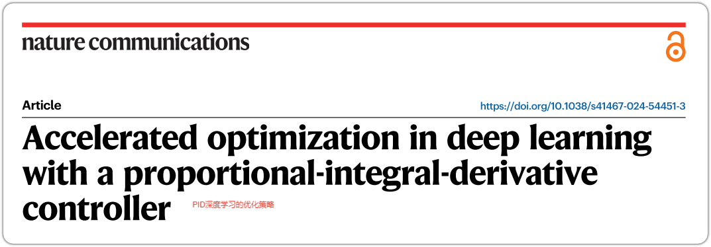
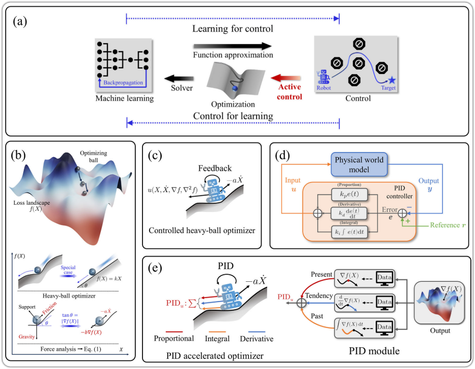
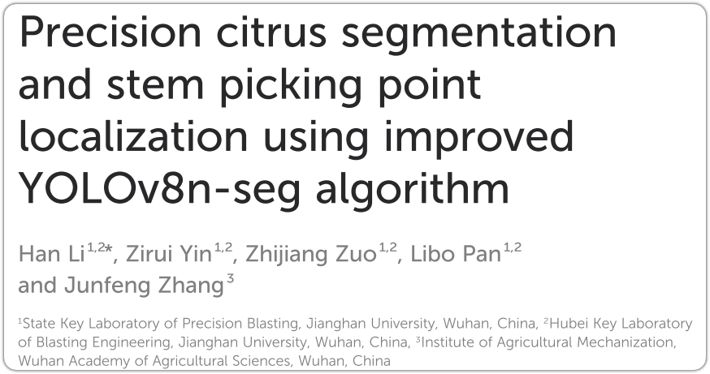

# 创新点的一些思考

[TOC]

---

> [!CAUTION]
>
> 这里的笔记主要是以论文为主要的创新点的搜集。

## 1.优化器方面

> [!NOTE]
>
> 首先说一下目前为止最常见的一些优化器
>
> **SGD**：随机梯度下降，最基本的一个优化器
> $$
> θ_{t+1}=θ _t−α⋅g_t
> $$
> 其中$g_t$就是反向传播求出来的那个梯度
>
> ---
>
> **SGD+Momentum**：带有动量的**SGD**模型
> $$
> \begin{aligned}
> v_t &= \beta \cdot v_{t-1} + (1 - \beta) \cdot g_t \\
> \theta_{t+1} &= \theta_t - \alpha \cdot v_t
> \end{aligned}
> $$
> $v_t$是不断叠加前几段的历史梯度的；$g_t$是求出来的梯度当前批量的梯度大小；$\beta$是动量系数，一般为0.9。这个算法相较于之前的那个，更加重视之前的历史参数，而且占比非常的高。
>
> ---
>
> **NAG**：先看未来的位置然后计算梯度，不在当点计算梯度而是根据历史的方向走到*未来的位置*，在那个点计算梯度
> $$
> \begin{aligned}
> \theta_{\text{pred}} &= \theta_t - \beta \cdot v_{t-1} \\
> v_t &= \beta \cdot v_{t-1} + (1 - \beta) \cdot \nabla L(\theta_{\text{pred}}) \\
> \theta_{t+1} &= \theta_t - \alpha \cdot v_t
> \end{aligned}
> $$
> 这个最重要的就是第一个公式，他先做的事情找到未来的位置，然后进行计算权重跟新的操作。
>
> ---
>
> **AdaGrad**：第一个自适应的权重优化器
> $$
> \begin{aligned}
> G_t &= G_{t-1} + g_t^2 \\
> \theta_{t+1} &= \theta_t - \frac{\alpha}{\sqrt{G_t + \epsilon}} \cdot g_t
> \end{aligned}
> $$
> 累计历史的平方和，同时使用这个东西来动态的计算学习率。其中$\epsilon$是极小值，防止分母为零。
>
> ---
>
> **RMSProp**：主要就是要解决前面那个优化器学习率单调递减的问题
> $$
> \begin{aligned}
> E[g^2]_t &= \beta \cdot E[g^2]_{t-1} + (1 - \beta) \cdot g_t^2 \\
> \theta_{t+1} &= \theta_t - \frac{\alpha}{\sqrt{E[g^2]_t + \epsilon}} \cdot g_t
> \end{aligned}
> $$
> 这里主要使用的是关注最近两次的梯度变化，不会让学习率一致衰减。$\beta$是之前的衰减系数
>
> ---
>
> **Adam**：应该算是最强的一个优化器了，自适应优化器的集大成者
> $$
> \begin{aligned}
> &\text{1. 一阶动量 (对应 Momentum, 梯度的 EMA)} \\
> &m_t = \beta_1 \cdot m_{t-1} + (1 - \beta_1) \cdot g_t \\
> \\
> &\text{2. 二阶动量 (对应 RMSProp, 梯度平方的 EMA)} \\
> &v_t = \beta_2 \cdot v_{t-1} + (1 - \beta_2) \cdot g_t^2 \\
> \\
> &\text{3. 偏差修正 (解决初始阶段 EMA 的偏置问题)} \\
> &\hat{m}_t = \frac{m_t}{1 - \beta_1^t}, \quad \hat{v}_t = \frac{v_t}{1 - \beta_2^t} \\
> \\
> &\text{4. 参数更新} \\
> &\theta_{t+1} = \theta_t - \frac{\alpha}{\sqrt{\hat{v}_t} + \epsilon} \cdot \hat{m}_t
> \end{aligned}
> $$
> 主要就是增加了二阶动量以及偏正修正。
>
> **AdamW**：主要目的就是为了修正Adam的致命缺陷，是当前首选的一种方式
> $$
> \begin{aligned}
> &\text{1. 一阶动量 (对应 Momentum, 梯度的 EMA)} \\
> &m_t = \beta_1 \cdot m_{t-1} + (1 - \beta_1) \cdot g_t \\
> \\
> &\text{2. 二阶动量 (对应 RMSProp, 梯度平方的 EMA)} \\
> &v_t = \beta_2 \cdot v_{t-1} + (1 - \beta_2) \cdot g_t^2 \\
> \\
> &\text{3. 偏差修正 (解决初始阶段 EMA 的偏置问题)} \\
> &\hat{m}_t = \frac{m_t}{1 - \beta_1^t}, \quad \hat{v}_t = \frac{v_t}{1 - \beta_2^t} \\
> \\
> &\text{4. 参数更新} \\
> &\theta_{t+1} = \theta_t - \alpha \cdot \left( \frac{\hat{m}_t}{\sqrt{\hat{v}_t} + \epsilon} + \lambda \cdot \theta_t \right)
> \end{aligned}
> $$
> 增加了一组解耦的权重衰减系数。其中$\lambda$是衰减系数，默认为0.01等。

---

### 1.1.使用比例积分微分控制器加速深度学习优化

> Accelerated optimization in deep learning with a proportional-integral-derivative controller[原文](E:\zotero_storge\storage\8SR4L6LC\Chen 等 - 2024 - Accelerated optimization in deep learning with a proportional-integral-derivative controller.pdf)
>
> 

#### 1.1.1.主要原理

这篇文章最主要的创新点就是使用了PID配合之前的二阶加速度来实现闭环控制。其最主要的就是一系列的公式计算

在之前主流的权重更新还是以动量法为主他的权重更新计算公式为：

> 就是上面的那个SGD+momentum公式

$$
x_{k+1} = x_k + \beta (x_{k} - x_{k-1} - bs \nabla f(x_k))
$$

在这个的基础之上做了几个比较重要的改变



##### 1.从动量法到连续时间动力学系统

上面的那个公式是不连续的一个公式，我们需要让他变得连续的公式，因此对其进行一些变换，具体变换的过程就不再进行推导了，变换后得到：
$$
\ddot{X} + a\dot{X} + b\nabla f(X) = 0
$$
其中$a \triangleq \frac{1-\beta}{\sqrt{s}}$充当阻尼系数，变量$X(t)$代表当前的状态

作者在这里面对于这个公式的物理解释是：我们将这个损失函数的曲面充当是一个地平面小球是我们的模型预测的位置，最后的目标是达到损失函数的最低点也就是小球到达最低点。原本只有一个在当前位置的梯度，闲杂哎引入了一些变量函数，在斜面之上小球受到了重力，支持力，摩擦力三个力，对这三个力正交分解，获得了沿斜面向上的阻力，以及沿斜面向下的动力。

- $-b\nabla f(X)$就是沿着斜面向下的动力
- $-a\ddot{X}$就是沿斜面向上的阻力
- $\nabla f(X)$梯度也就是对应了斜面的正切值$tan(\theta)$

##### 2.引入主动反馈控制

之前的函数非常的依赖$a$的取取值，效果并不好。

作者引入了一套带有主动控制输入$u$的二阶机械系统*【注】我的天哪，这个居然是机械系统，感觉和我的专业有异曲同工之妙*
$$
\ddot{X} + a\dot{X} + u(X, \dot{X}, \nabla f(X), \nabla^{2}f(X)) = 0
$$
这个那么这样问题就变成了如何设计反馈的函数$u$了。

- $X$：当前的位置。
- $\dot{X}$：当前的运动速度。
- $\nabla f(X)$：当前的一阶环境信息（地形的坡度/梯度）。
- $\nabla^{2}f(X)$：当前的二阶环境信息（地形的曲率/海森矩阵）。

##### 3.引入PID

此时作者就引入了控制工程中最经典的理论原理PID控制算法$u = k_p y(t) + k_i \int_{t_0}^t y(s)ds + k_d \frac{dy(t)}{dt}$

这个算法中的$y(t)$就是指误差，在这里我们令它等于咱们的梯度即可，一个东西，毕竟梯度也是用误差反向传播求出来的。这样就得到了
$$
\ddot{X} + a\dot{X} + k_p\nabla f(X) + k_i\int_{t_0}^t \nabla f(X)ds + k_d\frac{d\nabla f(X)}{dt} = 0
$$
而这就是全文最最核心的公式。这样一来这个优化器就又多了三个超参数了：

- **$k_p$ (比例，Present)**

- **$k_i$ (积分，Past)**

- **$k_d$ (微分，Tendency)**

#### 1.1.2.主要代码

```python
class PIDAO(Optimizer):
    """
    基于 Nature Communications 2024 的 PIDAO 优化器。
    专为 YOLO 动态学习率 (Warmup/Scheduler) 和权重衰减 (Weight Decay) 进行了工程重构。
    """

    def __init__(self, params, lr=1e-3, eq_momentum=0.9, weight_decay=0.0, kp=None, ki=1.0, kd=0.1):
        if lr < 0.0:
            raise ValueError(f"Invalid learning rate: {lr}")

        # 将超参数存入 defaults 字典，注意这里保存的是 eq_momentum 而不是直接固定的 a
        defaults = dict(
            lr=lr,
            eq_momentum=eq_momentum,
            weight_decay=weight_decay,
            ki=ki,
            kd=kd
        )
        super(PIDAO, self).__init__(params, defaults)

    @torch.no_grad()
    def step(self, closure=None):
        loss = None
        if closure is not None:
            with torch.enable_grad():
                loss = closure()

        for group in self.param_groups:
            h = group['lr']

            # 防御性限制：当 YOLO 传入极小或为 0 的学习率时，跳过离散化更新以防止除零溢出
            if h <= 1e-8:
                continue

            a_eq = group['eq_momentum']
            ki = group['ki']
            kd = group['kd']
            weight_decay = group['weight_decay']

            # ==========================================
            # 核心修改 1：动态物理环境推导
            # 由于 YOLO 会动态改变 lr(h)，我们必须在每次迭代时
            # 根据当前的步长 h 重新推导物理系统的阻尼 a 和推力 kp
            # ==========================================
            a = (1.0 / a_eq - 1.0) / h
            kp = 1.0 / (a_eq * h)

            # 预计算半隐式欧拉推导出的常数项，降低循环内的浮点计算量
            denom = 1.0 + a * h
            grad_coeff = h * (kp - a * kd)

            for p in group['params']:
                if p.grad is None:
                    continue

                # 核心修改 2：兼容 YOLO 的 weight_decay (L2 正则化)
                grad = p.grad
                if weight_decay != 0:
                    grad = grad.add(p, alpha=weight_decay)

                state = self.state[p]

                # 物理状态初始化
                if len(state) == 0:
                    state['step'] = 0
                    # 积分项 Z
                    state['z'] = torch.zeros_like(p, memory_format=torch.preserve_format)
                    # 虚拟速度项 Y
                    state['y'] = torch.zeros_like(p, memory_format=torch.preserve_format)

                z = state['z']
                y = state['y']
                state['step'] += 1

                # ==========================================
                # 严格对照 SI 离散化的代码更新逻辑
                # ==========================================

                # 1. 更新积分项 Z (累积历史信息)
                z.add_(grad, alpha=h)

                # 2. 更新虚拟速度 Y (修复了旧版的张量减标量 Bug)
                y.sub_(grad, alpha=grad_coeff)
                y.sub_(z, alpha=h * ki)
                y.div_(denom)

                # 3. 更新参数物理坐标 X
                p.add_(y, alpha=h)
                p.sub_(grad, alpha=h * kd)

        return loss
```

---


## 2.主干部分创新

## 3.方法思考-柑橘套袋

### 3.1.使用改进的YOLOV8n-seg算法进行柑橘精确分割和茎采摘点定位

> Precision citrus segmentation and stem picking point localization using improved YOLOv8n-seg algorithm
>
> 

#### 3.1.1.主要原理

| 模型                    | Box mAP50 | Box mAP50-95 | Mask mAP50 | Mask mAP50-95 | 训练时间(秒) |
| :---------------------- | :-------- | :----------- | :--------- | :------------ | :----------- |
| 模型A                   | 0.7790    | 0.4825       | 0.6632     | 0.2374        | 4128         |
| 模型B                   | 0.7410    | 0.4437       | 0.6298     | 0.2226        | 2947         |
| 模型C                   | 0.7206    | 0.4177       | 0.5966     | 0.2168        | 4158         |
| 模型D                   | 0.7246    | 0.4096       | 0.5917     | 0.2036        | 3682         |
| 模型E                   | 0.7756    | 0.4770       | 0.6364     | 0.2265        | 3703         |
| 模型F                   | 0.6487    | 0.3495       | 0.5409     | 0.1900        | 2929         |
| **第7次（Dense_Skip）** | **0.803** | **0.518**    | **0.679**  | **0.252**     | **16204**    |

