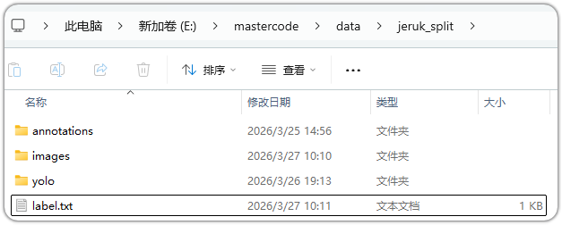
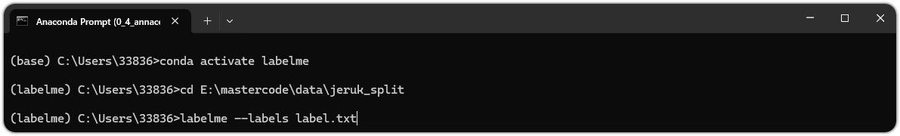
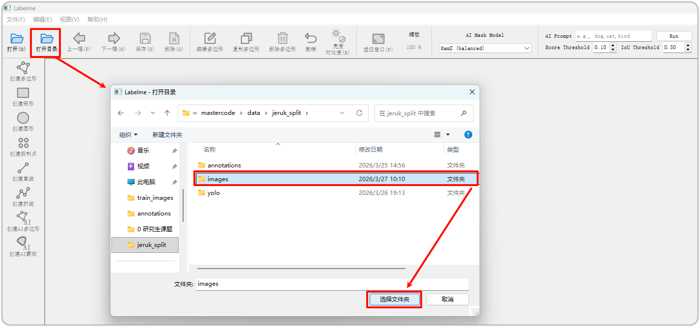
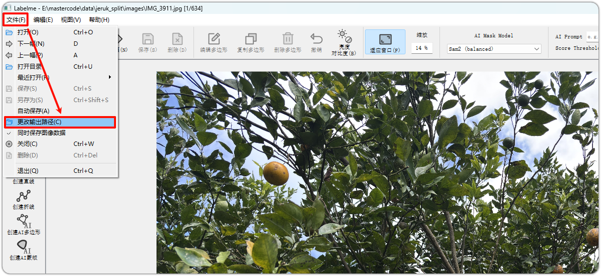
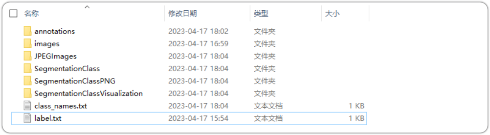

这里主要记录一下如何使用`labelme`进行数据标注，以分割为主要需求进行

> 需要准备好三个东西，一个是anaconda、一个是等待标注的文件、另一个是自己的电脑

## 1.labelme的安装，准备数据

首先进入`anaconda`的`prompt`的界面之中，进行安装`labelme`安装的代码非常简单

```bash
pip install labelme
```

然后准备好一些文件，需要图片中保持一致、各个文件夹的内容为：

1. annotations：现在是空的，为了防止后续的标注文件

2. images：最重要的图片文件夹，放了待标注的文件

3. yolo：不用管，是个假的，当他不存在即可

4. label：该文件算是一个申明，需要填写一些信息
    ```tex
    __ignore__
    _background_
    orange
    ```

    前两个照抄即可、最后的是你的类别可以增加或者减少问题不大



## 2.数据标注

完成之后打开`anaconda prompt`，并且导航到你的目标文件夹中

注意导航之前需要启动你的虚拟环境



```bash
conda activate labelme
cd E:\mastercode\data\jeruk_split
labelme --labels label.txt
```

这样一来就进入了界面之中，然后需要导航到咱们的图片文件夹中，这样一来就打开了这个图片文件夹



然后需要更改输出的路径，到咱们的annotations文件夹内



并将上面的自动保存按钮给他选择上，这样一来就可以打标签了。

## 3.数据转换问题

### 3.1.从json文件转换到yolo文件

```python
import json
import os


def coco_seg_to_yolo(json_path, output_dir):
    # 读取 JSON 文件
    with open(json_path, 'r', encoding='utf-8') as f:
        data = json.load(f)

    # 如果输出目录不存在则创建
    if not os.path.exists(output_dir):
        os.makedirs(output_dir)

    # 1. 建立 image_id 到 宽高的映射字典
    images_info = {}
    for image in data['images']:
        images_info[image['id']] = {
            'file_name': image['file_name'],
            'width': image['width'],
            'height': image['height']
        }

    # 2. 遍历 annotations 提取分割坐标
    count = 0
    for ann in data['annotations']:
        # 检查是否包含 segmentation 数据
        if 'segmentation' not in ann or not ann['segmentation']:
            continue

        # 如果 segmentation 是 RLE 格式（通常是字典，跳过）
        if isinstance(ann['segmentation'], dict):
            print(f"⚠️ 警告：跳过 RLE 格式的标注 (ID: {ann['id']})")
            continue

        image_id = ann['image_id']
        category_id = ann['category_id']

        # YOLO 类别索引从 0 开始
        yolo_class_id = category_id - 1

        # 获取当前图片的实际宽和高
        image_w = images_info[image_id]['width']
        image_h = images_info[image_id]['height']

        # 获取对应的文件名，把后缀换成 .txt
        file_name = images_info[image_id]['file_name']
        txt_name = os.path.splitext(file_name)[0] + '.txt'
        txt_path = os.path.join(output_dir, txt_name)

        # 写入文件（'a' 模式表示追加）
        with open(txt_path, 'a') as txt_file:
            # segmentation 通常是一个列表的列表，例如 [[x1, y1, x2, y2, ...]]
            for polygon in ann['segmentation']:
                # 过滤掉点数太少无法构成多边形的异常数据 (至少得有3个点，即6个坐标值)
                if len(polygon) < 6:
                    continue

                normalized_coords = []
                # 步长为 2 遍历坐标点，进行归一化 (x除以宽，y除以高)
                for i in range(0, len(polygon), 2):
                    x_norm = polygon[i] / image_w
                    y_norm = polygon[i + 1] / image_h
                    normalized_coords.append(f"{x_norm:.6f} {y_norm:.6f}")

                # 将类别 ID 和归一化后的坐标组合成 YOLO 分割格式
                line = f"{yolo_class_id} " + " ".join(normalized_coords) + "\n"
                txt_file.write(line)
                count += 1

    print(f"✅ 转换完成！共处理了 {count} 个多边形轮廓。")
    print(f"📁 YOLO 分割格式的 txt 文件已保存在: {output_dir}")


# --- 运行代码 ---
# 把 'your_dataset.json' 换成你这个 JSON 文件的实际路径
# 把 'yolo_seg_labels_output' 换成你想要保存新 txt 标签的文件夹路径
json_file_path = r"E:\mastercode\data\jeruk_split\annotations\instances_val.json"
output_folder = r'E:\mastercode\data\jeruk_split\labels\val'

coco_seg_to_yolo(json_file_path, output_folder)
```

### 3.2.将json文件转换成可以看清的掩码文件图片

```python
#!/usr/bin/env python

from __future__ import print_function

import argparse
import glob
import os
import os.path as osp

import imgviz
import numpy as np

import labelme


def main():
    parser = argparse.ArgumentParser(
        formatter_class=argparse.ArgumentDefaultsHelpFormatter
    )
    parser.add_argument("--input_dir", default="D:/Dataset/road_dataset/annotations", help="input annotated directory")
    parser.add_argument("--output_dir", default="D:/Dataset/road_dataset", help="output dataset directory")
    parser.add_argument("--labels", default="D:/Dataset/road_dataset/label.txt", help="labels file")
    args = parser.parse_args()
    args.noviz = False

    if not osp.exists(args.output_dir):
        os.makedirs(args.output_dir)
    os.makedirs(osp.join(args.output_dir, "JPEGImages"))
    os.makedirs(osp.join(args.output_dir, "SegmentationClass"))
    os.makedirs(osp.join(args.output_dir, "SegmentationClassPNG"))

    if not args.noviz:
        os.makedirs(
            osp.join(args.output_dir, "SegmentationClassVisualization")
        )
    print("Creating dataset:", args.output_dir)

    class_names = []
    class_name_to_id = {}
    for i, line in enumerate(open(args.labels).readlines()):
        class_id = i - 1  # starts with -1
        class_name = line.strip()
        class_name_to_id[class_name] = class_id
        if class_id == -1:
            assert class_name == "__ignore__"
            continue
        elif class_id == 0:
            assert class_name == "_background_"
        class_names.append(class_name)
    class_names = tuple(class_names)
    print("class_names:", class_names)
    out_class_names_file = osp.join(args.output_dir, "class_names.txt")
    with open(out_class_names_file, "w") as f:
        f.writelines("\n".join(class_names))
    print("Saved class_names:", out_class_names_file)

    for filename in glob.glob(osp.join(args.input_dir, "*.json")):
        print("Generating dataset from:", filename)

        label_file = labelme.LabelFile(filename=filename)

        base = osp.splitext(osp.basename(filename))[0]
        out_img_file = osp.join(args.output_dir, "JPEGImages", base + ".jpg")
        out_lbl_file = osp.join(
            args.output_dir, "SegmentationClass", base + ".npy"
        )
        out_png_file = osp.join(
            args.output_dir, "SegmentationClassPNG", base + ".png"
        )
        if not args.noviz:
            out_viz_file = osp.join(
                args.output_dir,
                "SegmentationClassVisualization",
                base + ".jpg",
            )

        with open(out_img_file, "wb") as f:
            f.write(label_file.imageData)
        img = labelme.utils.img_data_to_arr(label_file.imageData)

        lbl, _ = labelme.utils.shapes_to_label(
            img_shape=img.shape,
            shapes=label_file.shapes,
            label_name_to_value=class_name_to_id,
        )
        labelme.utils.lblsave(out_png_file, lbl)

        np.save(out_lbl_file, lbl)

        if not args.noviz:
            viz = imgviz.label2rgb(
                lbl,
                imgviz.rgb2gray(img),
                font_size=15,
                label_names=class_names,
                loc="rb",
            )
            imgviz.io.imsave(out_viz_file, viz)


if __name__ == "__main__":
    main()
```

这个运行完毕之后会多出一些文件：

- JPEGImages：原始图像
- SegmentationClass：npy格式label
- SegmentationClassPNG：掩码图像
- SegmentationClassVisualization：掩码图像和实景图像叠加显示
- class_names.txt：全部类别(包括背景)



同时需要进行标签可视化操作

```python
import json
import cv2
import numpy as np
from tqdm import tqdm
import os

fill_color = (255, 255, 255)
root_dir = 'D:/Dataset/road_dataset'


def visualize_one(label_name):
    with open(root_dir + '/annotations' + '/' + label_name + '.json', 'r') as obj:
        dict = json.load(obj)
    img = cv2.imread(root_dir + '/images' + '/' + label_name + '.jpg')
    for label in dict['shapes']:
        points = np.array(label['points'], dtype=np.int32)
        black_img = np.zeros(img.shape)
        cv2.polylines(black_img, [points], isClosed=True, color=fill_color, thickness=1)
        cv2.fillPoly(black_img, [points], color=fill_color)

    cv2.imwrite(root_dir + '/labels' + '/' + label_name + '.jpg', black_img)


if __name__ == '__main__':
    os.mkdir(root_dir + '/labels')
    for i in tqdm(os.listdir(os.path.join(root_dir, "annotations"))):
        label_name = i[:-5]
        visualize_one(label_name)
```

运行结束后可以看到那些很好的标签了，就是掩码图片黑白颜色标签。