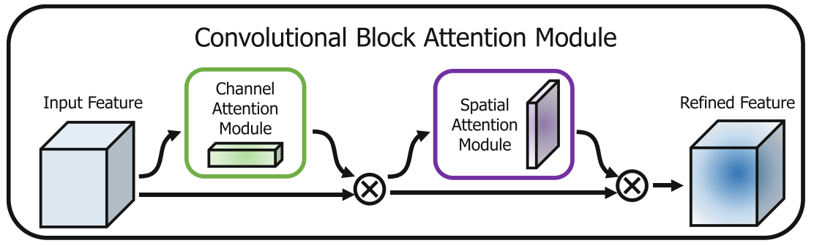
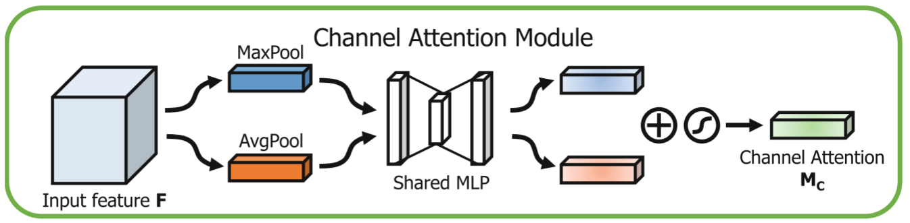
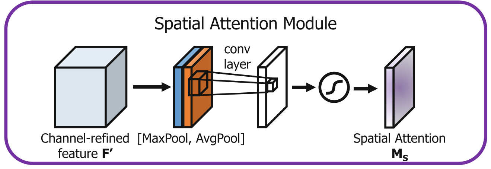
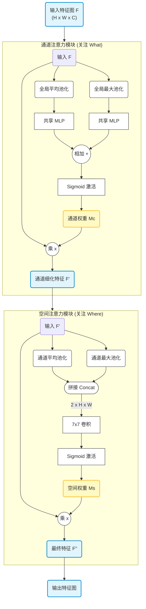
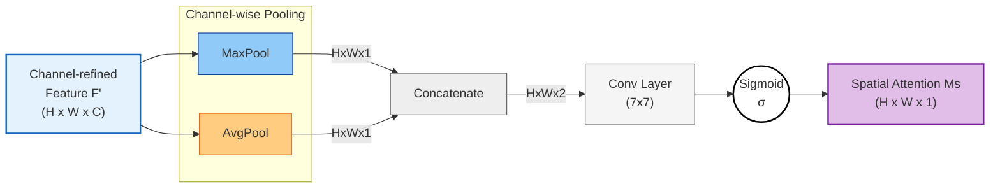

# $CBAM(Convolutional Block Attention Module)$

> [!NOTE]
>
> $CBAM$注意力机制模块他本来的名字是卷积注意力机制模块$-Convolutional Block Attention Module$，该注意力机制是*Sanghyun Woo*等人在*2018*年在论文*CBAM: Convolutional Block Attention Module*提出来的。
>
> [CBAM论文地址](https://arxiv.org/abs/1807.06521)

现在就对该算法进行一些解读和自己的理解，我将从原理，公式推导，以及代码结构进行阐述。

## 1. 背景原理

在很多的图像处理相关的领域卷积神经网络发挥了极为重要的作用，卷积神经网络以其强大的表征能力，极大的提高了视觉任务的性能。那么卷积神经网络的性能主要研究的三大因素是什么呢？什么是影响卷积神经网络性能的主要因素呢？
不难猜到就是下面三个：

1. 深度$(depth)$：卷积神经网络**串联的总体层数**。

2. 宽度$(width)$：卷积神经网络的**通道个数**。
3. 基数$(cardinality)$：卷积神经网络的**分支个数**。

对于深度这个方面，在之前$2016$年由何凯明大神提出的$ResNet$残差连接就已经实现了非常深的网络进行训练；
对于宽度这个方面，在之前$2015$年由$google$公司提出的$GoogleNet$网络也已经实现。
对于基数这个方面，有更多的人都在进行努力。

但是除了这上面的几个因素之外，还引入了一个注意力的机制，可以让网络自动调节自己所重要的特征的权重。之前的$SE$注意力机制主要关注的通道这方面的问题，但是我们是不是可以将通道和空间的注意力机制相互融合以实现一种新的注意力机制模块呢？
那么$CBAM$模块油然而生。

> 这里就简单的讲一下什么是通道注意力，什么是空间注意力机制吧！
>
> 大家都知道在深度学习网络过程中，每个过程的图像批量实际上是四个维度的东西，分别是$(B-Batch，C-channel，H-hight，W-width)$，这四个维度就是每一次输入输出的玩意儿。
> 用大白话来说就是，一箱相册，一个箱子有很多图片册，而每个图片册有很多张图片，每个图片又有长度和宽度。之前我们主要关注的是图片册中每张图片整体的感觉；但是忽略了图片中的一些细节问题。
>
> 通道注意力主要就是在$-channel$也就是$C$上做操作。
> 空间注意力主要就是在$-H$和$W$上面做操作。

1. 通道注意力机制：关注**是什么**
2. 空间注意力机制：关注**在哪里**

$ok$那么到现在我们就将*通道*和*空间*两个维度进行了很好的区分，$CBAM$的核心思想就是将这两个维度结合起来。

但是$CBAM$并没有把它们一股脑混在一起处理，而是采用了$串联$的方式。

这就好比我们找东西的逻辑：

1. 先想找什么先过通道注意力模块
2. 再看在哪里再过空间注意力模块



---


## 2.公式推导

这里主要有两组问题，也就是找什么东西和找的东西在哪里这两个问题。只有解决了这两个问题，才能够比较好的实现。

### 2.1.通道注意力

在这里要解决的是**找什么东西**的问题，也就是要解决的是那个通道更加的重要一些。

在$CBAM$中，作者认为最大池化$(Max Pooling)$和平均池化$(Average Pooling)$包含了不同的信息特征，所以不同于$SE-Net$只用了平均池化，$CBAM$决定两个都要用。
$$
F_c=M_c(F)=\sigma(MLP(AvgPool(F))+MLP(MaxPool(F)))=\sigma(W_1(W_0(F^{c}_{avg})+W_1(W_0(F^{c}_{max}))
$$
具体步骤：

1. 对输入特征图$F$分别进行**全局平均池化**和**全局最大池化**。这样就把$C \times H \times W$的特征图变成了两个$C \times 1 \times 1$的向量。
    - $F_{avg}^c$：平均池化得到的向量。
    - $F_{max}^{c}$：最大池化得到的向量。
2. 把经过池化后的向量分别放入到一组共享的全连接层$MLP$。
3. 经过$sigmoid$函数归一化后和原始输入相乘。



### 2.2.空间注意力

解决了看什么，接下来要推导解决看哪里的空间注意力。

这时候输入的是**已经经过通道注意力加权后的特征图** $F'$。
$$
F_s = M_s(F')=\sigma(f^{7\times 7}([AvgPool(F),MaxPool(F)]))=\sigma(f^{7\times 7}([F^{S}_{avg},F^{S}_{max}]))
$$
具体步骤：

1. 压缩通道：这次我们要把通道维数压缩，所以在通道维度上分别做平均池化和最大池化。

    - 这就好比把厚厚的一叠相册(多个通道)压扁，看透视图。

    - 这就得到了两个二维的特征图：$F_{avg}^s$ 和 $F_{max}^s$(大小都是 $1 \times H \times W$)。

2. 通道拼接$concat$。

3. 卷积提取： 使用一个 $7 \times 7$ 的卷积核对拼接后的图进行卷积操作。

4. 经过$sigmoid$函数归一化后和原始输入相乘。



### 2.3.一些小问题

为什么通道注意力是使用直接相加的方式进行特征融合而空间注意力却是使用$concat$叠加的方式进行特征融合?

---


## 3.CBAM结构框图和代码展示

### 3.1.结构框图




### 3.2.代码展示

```python
import torch 
import torch.nn as nn
import matplotlib.pyplot as plt
import torch.nn.functional as F
import torch.optim as optim
from torchvision import datasets, transforms
from torch.utils.data import DataLoader
import numpy as np

class CBAMBlock(nn.Module):
    '''CBAM注意力机制模块
        包含通道注意力机制模块以及空间注意力机制模块
        Args:
            outchannels: 输入特征图的通道数
            reduction: 通道注意力机制模块中全连接层的缩减比例
    '''
    def __init__(self , outchannels , reduction = 4):
        super(CBAMBlock , self).__init__()
        # 通道注意力机制模块 channel attention module
        self.maxpool = nn.AdaptiveMaxPool2d(1)
        self.avgpool = nn.AdaptiveAvgPool2d(1)
        self.fc1 = nn.Linear(outchannels , outchannels // reduction , bias = False)
        self.relu = nn.ReLU()
        self.fc2 = nn.Linear(outchannels // reduction , outchannels , bias = False)
        self.sigmoid = nn.Sigmoid()

        # 空间注意力机制模块 spatial attention module
        self.conv = nn.Conv2d(in_channels=2 , out_channels = 1 , kernel_size = 7 , stride = 1 , padding = 3 , bias = False)

    def forward(self , x):
        '''
            前向传播函数
            1. 通道注意力机制模块
                a. 分别进行最大池化以及平均池化
                b. 通过全连接层进行特征提取(分别)
                c. 将两个特征直接相加，然后sigmoid归一化
            2. 空间注意力机制模块
                a. 对通道注意力机制模块的输出进行最大池化以及平均池化
                b. 将两个池化结果在通道维度上进行拼接
                c. 通过卷积层进行特征提取，然后sigmoid归一化
        '''
        # 通道注意力机制模块
        maxpool_out = self.maxpool(x)
        avgpool_out = self.avgpool(x)

        maxpool_out = maxpool_out.view(-1 , x.size(1)) 
        avgpool_out = avgpool_out.view(-1 , x.size(1))

        F_max = self.fc2(self.relu(self.fc1(maxpool_out)))       
        F_avg = self.fc2(self.relu(self.fc1(avgpool_out)))

        channel_attention_out = self.sigmoid(F_max+F_avg).unsqueeze(2).unsqueeze(3)  # [B , C , 1 , 1] , add操作
        F_1 = channel_attention_out * x

        # 空间注意力机制模块
        spatial_maxpool , _ = torch.max(F_1 , dim=1 , keepdim = True)                       # [B , 1 , H , W]
        spatial_avgpool = torch.mean(F_1 , dim=1 , keepdim = True)                          # [B , 1 , H , W]
        spatial_attention_out = torch.cat([spatial_maxpool , spatial_avgpool] , dim = 1)    # [B , 2 , H , W] , concat操作
        spatial_attention_out = self.sigmoid(self.conv(spatial_attention_out))              # [B , 1 , H , W]
        F_2 = spatial_attention_out * F_1

        return F_2
```





