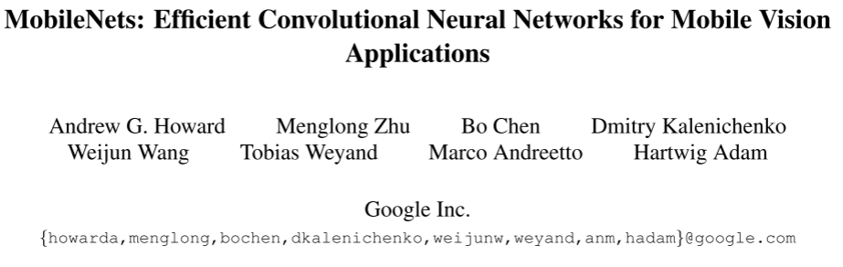
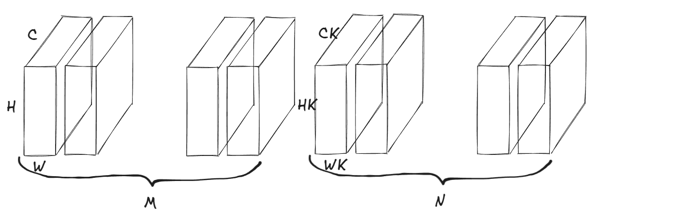
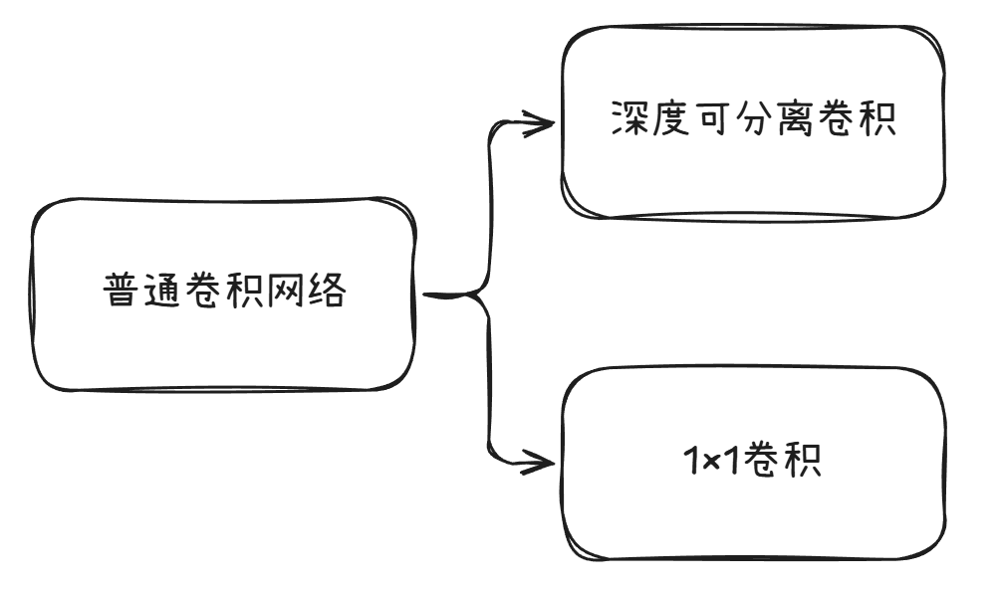
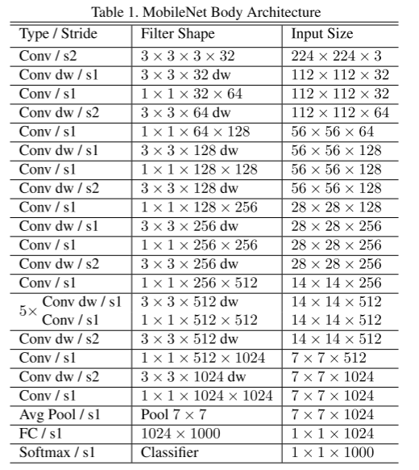

# $MobileNet V1-$论文复现研读

> [!NOTE]
>
> $MobileNets$本名$Efficient Convolutional Neural Networks for Mobile Vision Applications$不难看出，这个文章提出来就是这么一个目的-尽可能的降低神经网络尤其是基于视觉的神经网络的运算量，以便其能够运用在最最基本的那些可移动设备之上譬如*手机*、*单片机*等等。
>
> [论文原文](https://arxiv.org/abs/1704.04861)

## 1.背景原理



在智能手机、无人机、嵌入式摄像头等移动设备日益普及的今天，我们越来越期待这些设备能够实时完成图像分类、目标检测、人脸识别等智能任务。然而，传统的卷积神经网络通常需要巨大的计算资源和内存，难以在资源受限的移动设备上高效运行。正是在这样的背景下，$Google$的研究团队提出了$MobileNet V1$，一种专为移动和嵌入式视觉应用设计的高效卷积神经网络。

$MobielNet$网络最主要的目的就是尽可能的降低计算量，而一般的深度神经网络，尤其是在LeNet-5提出之后，其最主要的计算量仍然集中在基础卷积之上，那么我们有没有一种方法可以尽可能的降低基础卷积的计算量呢？

因此*Andrew G. Howard*团队的众人就根据这个提出了深度可分离卷积，将最普通的卷积操作分两个步骤来进行，用于大大降低它的计算量。

首先我们需要说一下为什么基本的卷积模块计算量会如此之大？他究竟是多大的计算量？又分成那几个步骤进行的？

在讲解之前我们需要先确定一些基本的物理量，设：

1. 输入量：$INPUT-(M \times C \times H \times W)$。

    1. 输入的图片大小为$H \times W$，其中$H$表示的是图像的高度，$W$表示的是图像的宽度；

    2. 输入的图片通道数为$C$；

    3. 输入的图片集合批量为$M$。

2. 卷积核尺寸：$Kernel-(N \times C_K \times H_K \times W_K)$。

3. 同时令步长$Stride=1$，以及填充$Padding=1$。

就像是这个图片展示的这个样子



那么这么一来我们想一下卷积是怎么进行卷积的。我想可以分成下面三个步骤：

1. 卷积批次中第$i$个批次第$j$个通道的卷积核**同**图片批次中第$i$个批次第$j$个通道的二维图片进行滑动卷积，那么这么卷下来，每个批次都有$C$张中间图片。
2. 将这C张中间图片直接进行相加，对你并没有看错，直接进行相加操作。
3. 得到最后的结果。

仔细看一下，最主要的计算量就是第一步卷积，以及第二部融合，这个是一次普通卷积完成的计算量。

试着算一下计算量的大小：

$计算量=M\times C \times H \times W \times HK \times WK \times CK \times N$

这个计算量可以说是相当之大呀！！

那么我们有没有方法可以将这个计算量尽可能降低呢，将这两步不是直接相乘而是相加呢？在这个考虑之下**深度可分离卷积**的思想孕育而生了。

## 2.网络架构

这个所谓的深度可分离卷积听上去非常的高大上，但是实际上是一个非常基本的运用罢了，它将标准卷积分解为两个更轻量的操作：

1. 深度卷积：对每个输入通道使用单独卷积核
2. 逐点卷积：使用1×1卷积融合通道信息

那么这两个步骤到底又有什么用处呢？



实际上，深度卷积主要针对的就是对每个输入通道单独做卷积操作。假设输入特征图有M个通道，那么我们使用M个卷积核，每个卷积核只负责一个通道。也就是说，每个卷积核在输入的一个通道上滑动，生成对应通道的输出。因此，深度卷积的输出通道数等于输入通道数，各通道之间没有交互。

> 也就是说对于深度卷积，他少了普通卷积的第二个步骤-将各个通道的图片直接相加。 
>
> *一个通道对应一个通道，不相加的*

设输入特征图尺寸为$D_F \times D_F \times M$，卷积核尺寸为 $DK×DK$。由于每个卷积核只处理一个通道，所以每个卷积核的计算量为 $DK×DK×DF×DF$，共有$M$个这样的卷积核，因此总计算量为：

$DK×DK×M×DF×DF$

而对于逐点卷积而言,它实际上就是$1x1$卷积，它的主要作用是融合通道信息。经过深度卷积后，我们得到了M个通道的特征图，但通道之间没有交互。逐点卷积通过$1x1$的卷积核将$M$个通道的信息进行组合，生成新的$N$个通道的特征图。

> 也就是说对于逐点卷积而言，它少量普通卷积的第一个步骤-将进行各个通道的卷积操作
>
> *一个批次对应一张图片，仅仅只进行相加的操作。*

同样，假设输入特征图尺寸为$DF×DF×M$，使用$N$个$1x1$的卷积核，每个卷积核的操作可以看作是对每个位置进行$M$次乘加然后求和，所以每个卷积核的计算量为$DK×DK×DF×DF$，$N$个卷积核的总计算量为：

$M×DF×DF×Dk×DK$

综上所述

- 标准卷积的计算量：$O_{std} = D_F^2 \cdot M \cdot N \cdot D_K^2$
- 深度可分离卷积的计算量：$O_{depthsep} = D_F^2 \cdot M \cdot D_K^2 + D_F^2 \cdot M \cdot N$

> 有一个反常识的东西：串联的计算量并非是直接相乘的而是相加的。

这个速度完全快了超级的多呀！！！

实际上在我看来，初代的$MobileNet$网络的目的就是降低计算量之后猛拉深度，同时深度可分离卷积是它最大的一个创新点，也就是说以后可以使用**深度可分离卷积**来代替普通的**卷积计算**了！

## 3.代码实现

### 3.1.网络的实验整体架构

```mermaid
graph LR
    %% 样式定义
    classDef input fill:#e3f2fd,stroke:#1565c0,stroke-width:2px;
    classDef stage fill:#f3e5f5,stroke:#7b1fa2,stroke-width:1px,stroke-dasharray: 5 5;
    classDef block fill:#ffffff,stroke:#4a148c,stroke-width:1px;
    classDef repeat fill:#fff8e1,stroke:#ffa000,stroke-width:2px;
    classDef head fill:#e8f5e9,stroke:#2e7d32,stroke-width:2px;

    %% 输入
    In([Input<br/>224x224]):::input

    %% --- Stage 1: 降采样至 112 ---
    subgraph S1 [Stage 1: 112x112]
        direction LR
        C1[Std Conv / s2<br/>32ch]:::block
        D1[DSC / s1<br/>64ch]:::block
        C1 --> D1
    end

    %% --- Stage 2: 降采样至 56 ---
    subgraph S2 [Stage 2: 56x56]
        direction LR
        D2[DSC / s2<br/>128ch]:::block
        D3[DSC / s1<br/>128ch]:::block
        D2 --> D3
    end

    %% --- Stage 3: 降采样至 28 ---
    subgraph S3 [Stage 3: 28x28]
        direction LR
        D4[DSC / s2<br/>256ch]:::block
        D5[DSC / s1<br/>256ch]:::block
        D4 --> D5
    end

    %% --- Stage 4: 降采样至 14 (深度提取) ---
    subgraph S4 [Stage 4: 14x14]
        direction LR
        D6[DSC / s2<br/>512ch]:::block
        D7{{x5 Repeated<br/>DSC / s1<br/>512ch}}:::repeat
        D6 --> D7
    end

    %% --- Stage 5: 降采样至 7 ---
    subgraph S5 [Stage 5: 7x7]
        direction LR
        D8[DSC / s2<br/>1024ch]:::block
        D9[DSC / s1<br/>1024ch]:::block
        D8 --> D9
    end

    %% --- Classification Head ---
    subgraph Head [Classifier]
        direction LR
        Pool[Avg Pool<br/>7x7]:::head
        FC[FC 1000]:::head
        Soft(Softmax):::head
        Pool --> FC --> Soft
    end

    %% 连接各阶段
    In --> S1
    S1 --> S2
    S2 --> S3
    S3 --> S4
    S4 --> S5
    S5 --> Head
```





### 3.2.Pytorch代码实现

```python
import torch 
import torch.nn as nn
import torch.optim as optim
from torchvision import datasets, transforms
from torch.utils.data import DataLoader
import os
import numpy as np
import gzip
import sys
import matplotlib.pyplot as plt
from tqdm import tqdm
from PIL import Image
import warnings

class MobileNetV1_Block(nn.Module):
    def __init__(self , num_classes = 10 , in_channels = 3 , out_channels = 64 ,stride = 1):
        super(MobileNetV1_Block, self).__init__()
        # 深度可分离卷积 depthwise separable convolution
        self.conv1 = nn.Conv2d(
            in_channels=in_channels , 
            out_channels=in_channels , 
            kernel_size=3 , 
            stride=stride , 
            padding=1 , 
            groups=in_channels , 
            bias=False
            )
        self.bn1 = nn.BatchNorm2d(in_channels)
        self.relu = nn.ReLU(inplace=True)

        # 逐点卷积 pointwise convolution
        self.conv2 = nn.Conv2d(in_channels = in_channels , out_channels = out_channels , kernel_size=1 , stride=1 , padding=0 , bias=False)
        self.bn2 = nn.BatchNorm2d(out_channels)
        self.relu = nn.ReLU(inplace=True)

    def forward(self , x):
        x = self.conv1(x)
        x = self.bn1(x)
        x = self.relu(x)
        x = self.conv2(x)
        x = self.bn2(x)
        x = self.relu(x)
        return x
    
class MobileNetV1(nn.Module):
    def __init__(self , num_classes = 10):
    
        super(MobileNetV1 , self).__init__()
        # 第一层卷积层
        self.layer1 = nn.Sequential(
            nn.Conv2d(3 , 32 , kernel_size=3 , stride=1 , padding=1 , bias=False),
            nn.BatchNorm2d(32),
            nn.ReLU(inplace=True),
        )
        # 第二层深度可分离卷积层
        self.layer2 = nn.Sequential(
            MobileNetV1_Block(in_channels = 32 , out_channels=64 , stride=1)
        )
        # 第三层深度可分离卷积层
        self.layer3 = nn.Sequential(
            MobileNetV1_Block(in_channels = 64 , out_channels=128 , stride=2)
        )
        # 第四层深度可分离卷积层
        self.layer4 = nn.Sequential(
            MobileNetV1_Block(in_channels = 128 , out_channels=128 , stride=1)
        )
        # 第五层深度可分离卷积层
        self.layer5 = nn.Sequential(
            MobileNetV1_Block(in_channels = 128 , out_channels=256 , stride=2)
        )
        # 第六层深度可分离卷积层
        self.layer6 = nn.Sequential(
            MobileNetV1_Block(in_channels = 256 , out_channels=256 , stride=1)
        )
        # 第七层深度可分离卷积层
        self.layer7 = nn.Sequential(
            MobileNetV1_Block(in_channels = 256 , out_channels=512 , stride=2)
        )
        # 后续五个深度可分离卷积层
        self.layer8 = nn.Sequential(
            MobileNetV1_Block(in_channels = 512 , out_channels=512 , stride=1),
            MobileNetV1_Block(in_channels = 512 , out_channels=512 , stride=1),
            MobileNetV1_Block(in_channels = 512 , out_channels=512 , stride=1),
            MobileNetV1_Block(in_channels = 512 , out_channels=512 , stride=1),
            MobileNetV1_Block(in_channels = 512 , out_channels=512 , stride=1)
        )
        # 第十三层深度可分离卷积层
        self.layer9 = nn.Sequential(
            MobileNetV1_Block(in_channels = 512 , out_channels=1024 , stride=2)
        )
        # 第十四层深度可分离卷积层
        self.layer10 = nn.Sequential(
            MobileNetV1_Block(in_channels = 1024 , out_channels=1024 , stride=2)
        )
        # 平均池化层
        self.avgpool = nn.AdaptiveAvgPool2d(1)
        # 全连接层
        self.fc = nn.Linear(1024 , num_classes)

    def forward(self , x):
        x = self.layer1(x)
        x = self.layer2(x)
        x = self.layer3(x)
        x = self.layer4(x)
        x = self.layer5(x)
        x = self.layer6(x)
        x = self.layer7(x)
        x = self.layer8(x)
        x = self.layer9(x)
        x = self.layer10(x)
        x = self.avgpool(x)
        x = x.view(-1 , 1024)
        x = self.fc(x)
        return x
```

果然这玩意儿就是一个降低计算量之后猛拉深度的一个玩意儿。

