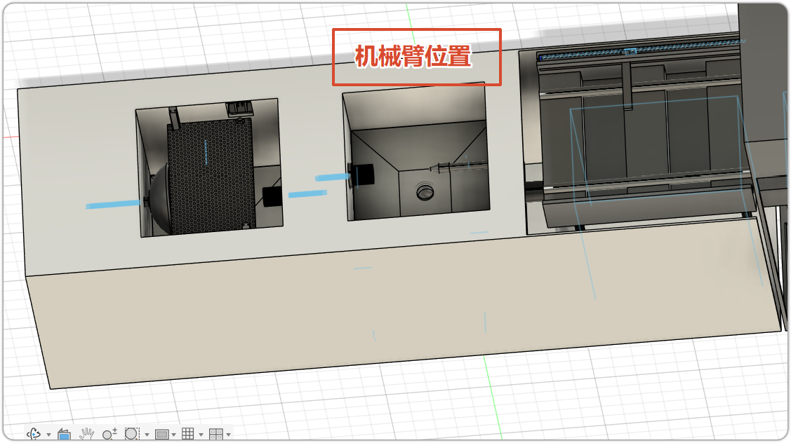
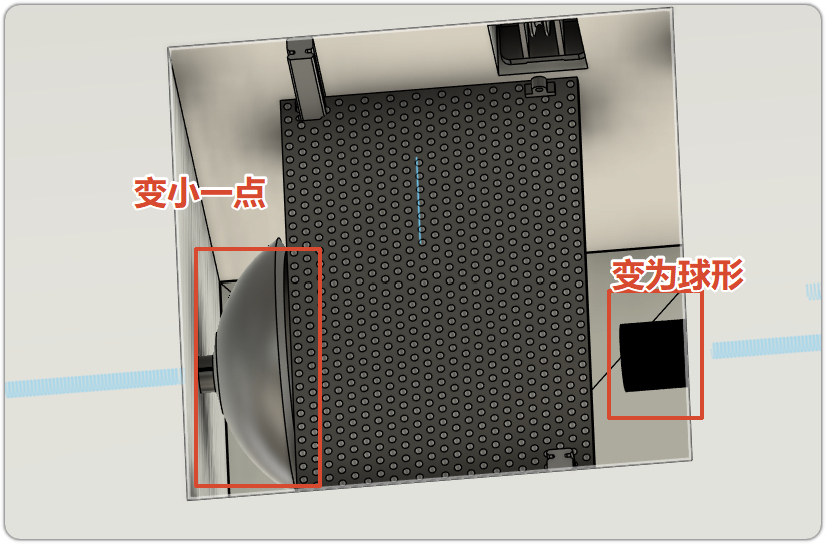
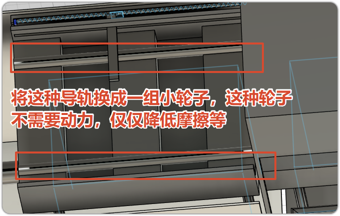
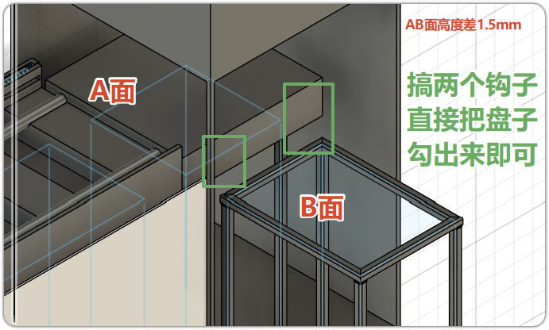

## 问题

1. 末端的消毒柜部分的转向仍然存在一定的问题
2. 机械手的末端执行器设计仍然存在一些问题
3. 控制系统相关的也没有做

## 流程

1. 粗洗部分
    1. 将碗筷放进去
    2. 完全浸入水池中，并用左侧的刷子将脏污初步去掉
    3. 存在一个过滤槽，污水下排，过滤后吸至上方进行循环利用
2. 精洗部分
    1. 一个高压水枪，从上向下进行冲刷
    2. 同时也存在过滤装置
3. 视觉部分
    1. 放置在两个水槽的正上方
    2. 识别碗的抓取的位置
    3. 识别并确认目标空置的篮子的摆放位置
4. 消毒部分
    1. 从篮子到消毒柜的部分，使用直线丝杆模组实现前后移动
    2. 消毒完毕后，从消毒柜到外面的传动使用一个直线模组加上一个挂钩来实现，前后往复运动

## 主要的改进思路

#### 1.机械臂附近问题

首先我说一下机械臂要做的事情。

- 将粗洗池里面出来的那些个碗筷等识别，并抓住。
- 抓着这东西放到精洗池的位置，进行双面洗刷，一部分刷碗内，另一部分喷碗底
- 将精洗池中的碗放置到托盘中的空位内，放的好一些。

那么现在知道了机械臂要做什么东西之后，你要做的事情：

1. 机械臂应当放在精洗池的正后方，毕竟手臂需要的范围在粗洗池、精洗池、托盘（消毒柜之前）；
    
    
    
2. 机械臂的末端执行器，应当存在的功能是实现抓取碗的同时能够实现手指和碗实现相对转动

    > 具体的东西应该和那种类似于带有全向轮的传送带

3. 机械臂能小就小一些，但是要求能够实现，机械臂的功能完美实现

---

#### 2.粗洗池的改进问题

还是一样需要说一下粗洗池应该做的事情：

- 【注意】：大块的垃圾已经在粗洗池前倒入倒垃圾桶之中了，因此现在的碗应当存在两种污渍：小块粘附性垃圾、油渍等垃圾

- 上半部分存在了两个东西，左侧是外部碗的凸面清洗，**请减小左侧的那个东西的尺寸**，右侧是内部刷子，请**将右侧的刷子变为球形**。

    

- 粗洗池内部存在大量的洗洁精等试剂，因此碗直接全部浸入倒粗细池子中，初步将油污去掉。

---

#### 3.精洗池

这里暂时没有什么需要进行修改的地方

---

#### 4.消毒柜部分

消毒柜现在存在的事情是：

- 将托盘送入到消毒柜之中
- 消毒柜转向输出方便拾取，同时尽可能减小空间的利用

现在这个地方有了不一样的说辞。

进入部分没有任何问题，你这种使用直线模组的推拉设计是没有问题的，但是你需要将那种**轨道换成一组小轮子**，一个是好看一个是将滑动摩擦变为滚动摩擦。

在后面的输出部分是有点问题的。

> [!IMPORTANT]
>
> 消毒柜子的内部是一个大平面，不存在任何的导轨等其他的问题，输出的地方也就是下半个部分使用的导轨也应该变为一组小滑轮。
>
> 同时要求消毒柜的水平面，略高于轨道的上平面，大概1-2mm，咱们设置为$1.5mm$防止它出不来

那么现在对于从消毒柜到外界吗，我们应该做的事情是，直接使用之前的钩子法将导轨直接勾出来，勾到导轨上面即可，注意使用的是两个完全平行的钩子勾出来。

直接拽出来，加轮子侧边

